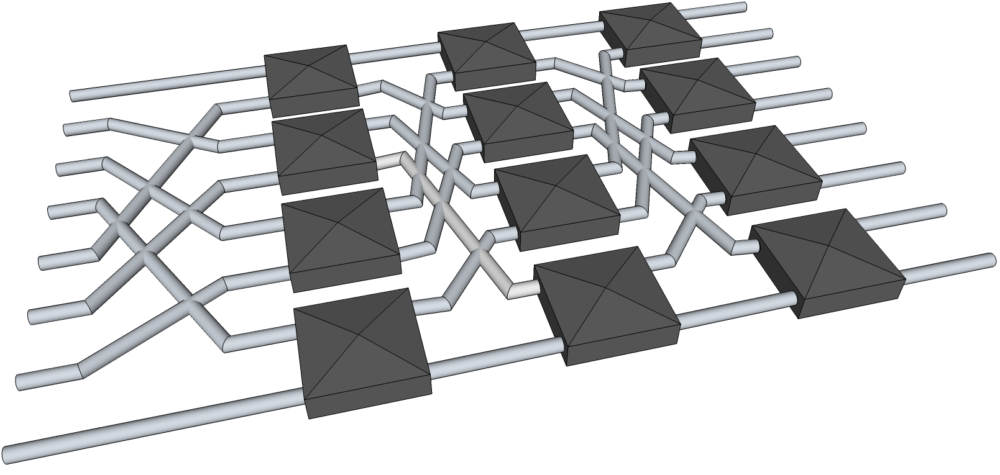

# -*- coding: utf-8 -*-
# -*- mode: org -*-
#+startup: beamer overview indent

#+TITLE: Análise de Desempenho de Sistemas Computacionais: Fundamentos e Metodologia Científica para HPC
#+AUTHOR: Lucas Mello Schnorr
#+EMAIL: schnorr@inf.ufrgs.br
#+DATE: 

#+LaTeX_CLASS: beamer
#+LaTeX_CLASS_OPTIONS: [10pt, xcolor=dvipsnames]
#+BEAMER_THEME: metropolis [numbering=fraction]
#+OPTIONS:   H:2 num:t toc:nil \n:nil @:t ::t |:t ^:t -:t f:t *:t <:t
#+LANGUAGE: pt-br
#+TAGS: noexport(n) ignore(i)
#+EXPORT_EXCLUDE_TAGS: noexport
#+EXPORT_SELECT_TAGS: export
#+LATEX_HEADER: \institute{Escola Regional de Alto Desempenho da Região Sul (ERAD/RS) -- 2026 \newline\newline \includegraphics[width=.6\linewidth]{./img/controle-coleta.pdf}\hfill\includegraphics[width=.2\linewidth]{./img/eradrs2026_transparente_278.png} \newline {\tiny Fonte da imagem: Fabricação própria com Inkscape}}
#+LATEX_HEADER: \usepackage{multicol}
#+LATEX_HEADER: \usepackage{subcaption}
#+LATEX_HEADER: \usepackage[backend=bibtex]{biblatex}
#+LATEX_HEADER: \bibliography{refs.bib}
#+LATEX_HEADER: \usepackage[T1]{fontenc}
#+LATEX_HEADER: \usepackage{palatino}
#+LATEX_HEADER: %\usepackage{enumitem}
#+LATEX_HEADER: %\setlist[itemize]{leftmargin=1.2em}
#+LATEX_HEADER: \input{org-babel.tex}

# You need at least Org 9 and Emacs 24 to make this work.

* Anotações                                                        :noexport:
1. Fundamentos conceituais (10-16)
2. Análise estatística (17-20)
3. Planejamento de experimentos (21-24)
4. Erros comuns e boas práticas (25-27)
5. Caracterização de carga (28-31)
6. Monitoramento e rastreamento (32-36)
7. Apresentação de resultados (37-40)
8. Conclusão e checklist (41-44)

* Propaganda
** Coisas adicionais por adicionar                                :noexport:
- [X] Slides sobre o HPC@UFRGS
- [X] Perímetros de investigação
- [X] Plataforma Computacional
- [ ] Formas de Controle
** Instituto de Informática em Porto Alegre -- RS

Vista geral de *Porto Alegre* em outubro, do Morro da Glória, 287 metros
#+latex: \vspace{-.2cm}
#+attr_latex: :width \linewidth
[[./img/poa.jpg]]

#+latex: \pause

Vista do centro histórico de *Porto Alegre*, do nível do Guaíba
#+latex: \vspace{-.2cm}
#+attr_latex: :width \linewidth
[[./img/guaiba.jpg]]

#+latex: \pause

#+latex: \vspace{-4cm}
#+attr_latex: :width .9\linewidth

#+BEGIN_CENTER
Vista dos jardins do *Instituto de Informática*, manhã fria de agosto
#+END_CENTER

** Programa de Pós-Graduação em Computação (PPGC)

Site do programa: http://www.inf.ufrgs.br/ppgc/

#+attr_latex: :width .2\linewidth
[[./img/logo-ppgc-187x118.png]]

Oferece
- _Mestrado_, entradas semestrais
  - Para quem quer bolsa, fazer o Poscomp (da SBC)
- _Doutorado_, entrada com fluxo continuo

#+latex: \vfill\pause

Fatos marcantes
- Conceito máximo (7) pela CAPES
- Internacionalização da formação e da investigação

#+latex: \vfill\pause

#+BEGIN_CENTER
*O evento ERAD/RS é uma boa oportunidade para sondar orientadores*.
#+END_CENTER

** GPPD - Grupo de Processamento Paralelo e Distribuído

Site do grupo de pesquisa:

http://www.inf.ufrgs.br/gppd/site/

Logo do grupo de pesquisa

#+attr_latex: :width .4\linewidth

Eixos principais de investigação
- *High Performance Computing* (Computação de Alto Desempenho)
- Computer Architecture
- Cloud Computing

** Parque Computacional de Alto Desempenho (PCAD)

URL: http://pcad.inf.ufrgs.br/

Possui \approx50 nós, \approx1000+ núcleos de CPU e \approx100000+ de GPU

#+attr_latex: :width .75\linewidth
[[./img/20240819_104551.jpg]]

Localização: /Data Center/ do Instituto de Informática, UFRGS

Temos um GT (Grupo de Trabalho)
- Formamos alunos no gerenciamento destas plataformas
- SLURM, NFS, LDAP, ...

** Quem sou eu?
*** Lucas Mello Schnorr
:PROPERTIES:
:BEAMER_col: 0.45
:BEAMER_opt: [t]
:BEAMER_env: block
:END:

#+latex: \bigskip

Prof. INF/UFRGS & PPGC

[[http://www.inf.ufrgs.br/~schnorr][http://www.inf.ufrgs.br/~schnorr]]

schnorr@inf.ufrgs.br

#+attr_latex: :width .5\linewidth
[[./img/lucas-schnorr.png]]

*** Formação
:PROPERTIES:
:BEAMER_col: 0.45
:BEAMER_opt: [t]
:BEAMER_env: block
:END:

Ciência da Computação
- Graduação UFSM (2003)
- Mestrado UFRGS (2005)
- Doutorado UFRGS co-tutela no INPG, Grenoble, França (2009)
- Pós-doutorado no CNRS (2010 -- 2012)
- Pós-doutorado no Inria (2016/2017)

* Introdução
** O Problema: Análise de Desempenho em HPC

*Pilar do método científico*: experimentos devem ser reprodutíveis

#+latex: \vfill\pause

*A realidade em HPC*
- Amostra de 120 artigos (ACM HPDC, SC, PPoPP, 2011–2014)
- Nenhum dos 95 artigos aplicáveis usa argumentos estatísticos formais
- Apenas 2 reportam intervalos de confiança
- 38% dos artigos que reportam aceleração omitem o desempenho absoluto do caso base

#+latex: \vfill\pause

#+begin_center
*A maioria dos resultados publicados em HPC não é reprodutível nem interpretável por terceiros*
#+end_center

** A Lacuna entre Clássicos e HPC

*Referências consolidadas* sobre avaliação de desempenho
- Jain, Lilja, Le Boudec
- Bases metodológicas sólidas, forte fundamentação estatística

#+latex: \vfill\pause

*O que os clássicos não cobrem*
- Variabilidade de aceleradores heterogêneos e ruído em máquinas grandes
- Dificuldades de reprodutibilidade em supercomputadores de acesso restrito
- Armadilhas de métricas paralelas: speedup, weak/strong scaling, eficiência MPI

#+latex: \vfill\pause

*O que a literatura HPC negligencia*
- Métricas escolhidas sem justificativa
- Experimentos sem medidas de variabilidade
- Comparações sem testes estatísticos

** Resposta Institucional e Persistência do Problema

*SC Reproducibility Initiative*
- Apêndice /Artifact Description/ obrigatório desde 2019
- Badges ACM: /Available/, /Functional/, /Reproduced/

#+latex: \vfill\pause

*Resultado*
- 90% dos respondentes estão cientes dos problemas de reprodutibilidade
- 77% mudaram sua forma de interpretar resultados publicados
- /Consciência != prática/: saber que deve reportar IC não basta se não se sabe construí-lo

#+latex: \vfill\pause

*Desempenho como distribuição*
- Distribuições multimodais, assimétricas, caudas pesadas: regra, não exceção
- O número de amostras necessário varia por uma ordem de grandeza entre benchmarks

** Organização do Minicurso

#+latex: \begin{columns}[t]
#+latex: \begin{column}{0.48\textwidth}

*Fundamentos*
1. Fundamentos conceituais
2. Análise estatística
3. Planejamento de experimentos
4. Erros comuns e boas práticas

#+latex: \end{column}
#+latex: \begin{column}{0.48\textwidth}

*Tópicos HPC*

5. [@5] Caracterização de carga
6. Monitoramento e rastreamento
7. Apresentação de resultados
8. Conclusão e checklist

#+latex: \end{column}
#+latex: \end{columns}

#+latex: \vfill\pause

*Fio condutor*: tensão entre rigor metodológico dos clássicos e especificidades do ambiente HPC

* Fundamentos Conceituais
** Objetivos da Avaliação de Desempenho

Quatro objetivos possíveis

#+latex: \vfill

- *Comparação entre alternativas*: escolher entre dois algoritmos ou configurações de hardware

#+latex: \pause

- *Caracterização do sistema*: entender comportamento sob diferentes condições de carga

#+latex: \pause

- *Dimensionamento* (/capacity planning/): prever comportamento sob cargas futuras

#+latex: \pause

- *Otimização*: identificar e eliminar gargalos

#+latex: \vfill\pause

#+latex: \begin{alertblock}{}
O objetivo escolhido determina métricas, técnica, workload, critério de sucesso e forma de apresentação
#+latex: \end{alertblock}

** Toda Avaliação de Desempenho é uma Modelagem

Distinção fundamental

#+latex: \vfill

O que se observa *não é o sistema em si*, mas uma projeção do sistema pelas métricas escolhidas

#+latex: \vfill\pause

*Cadeia de abstrações*:
#+begin_center
Sistema real → Modelo → Métrica → Número na tabela
#+end_center

#+latex: \vfill\pause

*Consequência prática*
- Cada elo é uma fonte potencial de erro
- Resultados têm validade apenas dentro do escopo do modelo adotado
- Afirmar que um sistema é "30% mais rápido" sem especificar carga, configuração e métrica é uma afirmação sem conteúdo científico

** O Processo de Avaliação

Sequência metodológica

1. Definição do sistema e escopo
2. Identificação dos objetivos
3. Listagem de métricas e parâmetros
4. Escolha da técnica de avaliação
5. Planejamento dos experimentos
6. Coleta de dados
7. Análise e interpretação
8. Apresentação dos resultados

#+latex: \vfill\pause

#+latex: \begin{alertblock}{}
*HARKing*: Hypothesizing After Results are Known
- Definir métricas *após* a coleta produz conclusões aparentemente confirmatórias, mas exploratórias
#+latex: \end{alertblock}

** Técnicas de Avaliação

#+attr_latex: :booktabs t :font \small
| *Critério*             | *Mod. Analítica* | *Simulação* | *Medição*       |
|----------------------+----------------+-----------+---------------|
| Fase do ciclo de vida | Qualquer       | Qualquer  | Pós-protótipo  |
| Precisão              | Baixa          | Moderada  | Alta           |
| Avaliação trade-off  | Fácil          | Moderada  | Difícil        |
| Custo                 | Baixo          | Médio     | Alto           |

#+latex: \vfill\pause

*As abordagens são complementares*
- Medições calibram modelos analíticos
- Modelos analíticos guiam o design dos experimentos
- Simulação permite explorar o espaço de parâmetros além do viável medir
- Tipicamente dois métodos para confirmar comportamentos

** Os Três Elementos Irredutíveis

Presentes em qualquer avaliação

#+latex: \vfill

*1. Sistema sob avaliação*
- Limites claramente definidos: o que é interno e o que é estímulo externo

#+latex: \pause\vfill

*2. Carga de trabalho (workload)*
- Conjunto de estímulos aplicados ao sistema durante a avaliação
- Representatividade vs. controlabilidade: tensão permanente

#+latex: \pause\vfill

*3. Métrica*
- O aspecto do comportamento que se deseja quantificar
- Boa métrica: linearidade, monotonicidade, interpretabilidade direta

** Hierarquia de Métricas

*Nível de sistema* (observáveis externamente)
- Tempo de resposta, vazão, utilização
- Adequadas para comparações entre sistemas distintos

#+latex: \pause\vfill

*Nível de componente* (requerem acesso interno)
- Taxa de /cache miss/, IPC, taxa de transferência de memória
- Adequadas para diagnóstico e otimização

#+latex: \pause\vfill

*Métricas derivadas* (razões entre métricas de sistema)
- Aceleração, eficiência, escalabilidade
- *Interpretação depende criticamente de como a baseline é definida*

#+latex: \pause\vfill

Para sistemas HPC modernos: FLOPS efetivos, largura de banda de memória, eficiência MPI, energia/operação (FLOPS/Watt)

** Métricas Paralelas: Speedup e Scaling

*Lei de Amdahl* (strong scaling)
- Fração serial $f$ limita aceleração máxima a $1/f$, independente do número de processos

#+latex: \vfill\pause

*Lei de Gustafson* (weak scaling)
- Problema cresce com o número de processos
- Mais adequada para aplicações científicas de larga escala

#+latex: \vfill\pause

*Load Imbalance Factor (LIF)*
$$\text{LIF} = \frac{\text{carga máxima}}{\text{carga média}} \qquad E_{lb} = \frac{T_{avg}}{T_{max}}$$
- LIF = 1: balanço perfeito; LIF > 1: limitado pelo processo mais sobrecarregado
- Captura a *magnitude* do desbalanceamento, não sua causa

* Análise Estatística
** Medidas de Tendência Central

A escolha depende da natureza do dado

#+latex: \vfill

*Média aritmética*: adequada para *custos* (tempo, energia)

#+latex: \pause\vfill

*Média harmônica*: adequada para *taxas* (flop/s, largura de banda)
$$\bar{x}_H = \frac{n}{\sum_{i=1}^n 1/x_i}$$

#+latex: \pause\vfill

*Média geométrica*: adequada para *razões adimensionais*

#+latex: \pause\vfill

*Mediana*: mais representativa que a média para distribuições assimétricas

#+latex: \vfill\pause

#+latex: \begin{alertblock}{}
Usar média aritmética como resumo universal é o erro mais disseminado em HPC
#+latex: \end{alertblock}

** Distribuições de Dados em HPC

*O mito das 30 amostras*
- Recomendação informal de 30–40 amostras para normalidade via TCL
- *Falsa para dados de desempenho em HPC*

#+latex: \vfill\pause

*Padrões comuns em HPC*
- Assimetria à direita, caudas pesadas
- Multimodalidade
- Picos estreitos (/spikes/)

#+latex: \vfill\pause

*Consequências*
- Para dados log-normais: transformação logarítmica + média geométrica
- Número de amostras deve ser determinado *dinamicamente*, não por regra de bolso
- Continuar coletando até que o IC de 99% esteja dentro de 5% da estimativa

** Intervalos de Confiança

*Para dados normais* (ou aproximadamente normais)
- Distribuição $t$ de Student com $n-1$ graus de liberdade
- *Testar normalidade antes*: Shapiro-Wilk + gráfico Q-Q

#+latex: \vfill\pause

*Para dados não-paramétricos* (IC para a mediana)
- Construído a partir de /ranks/ ordenados, sem pressupor forma distribucional
- IC pode ser assimétrico, refletindo a assimetria dos dados

#+latex: \vfill\pause

*Sobre outliers*
- Quando removidos, aplicar o método de Tukey
- *Sempre reportar o número de observações removidas*
- Omitir essa informação é manipulação silenciosa dos resultados

** Comparação Estatística de Configurações

*Sobre não-sobreposição de ICs*
- Suficiente para afirmar diferença, mas *não é condição necessária*
- Dois ICs podem se sobrepor e a diferença ainda ser significativa

#+latex: \vfill\pause

*Testes adequados*
- Dados normais: ANOVA / teste $F$
- Dados não-normais: Kruskal-Wallis (compara medianas)
- Múltiplas comparações: correção necessária (Bonferroni, Holm, etc.)

#+latex: \vfill\pause

*Além da significância estatística*
- Reportar também o *tamanho do efeito*
- Uma diferença pode ser estatisticamente significativa e praticamente irrelevante

#+latex: \vfill\pause

*Regressão de quantis*: o sistema com melhor latência mediana pode ter comportamento de cauda *pior* que o concorrente — invisível a análises baseadas em médias

* Planejamento de Experimentos
** Conceitos Fundamentais de Design Experimental

*Fatores e respostas*
- Fatores: variáveis controladas pelo experimentador
- Níveis: valores discretos que cada fator assume
- Resposta: métricas observadas

#+latex: \vfill\pause

*Design fatorial completo $2^k$*
- $k$ fatores em 2 níveis cada
- Estima efeitos principais *e* interações entre fatores
- Número de experimentos cresce exponencialmente com $k$

#+latex: \vfill\pause

*Design fatorial fracionado $2^{k-p}$*
- Reduz número de experimentos por fator $2^p$
- Custo: confunde interações de ordem alta com efeitos principais
- Aceitável quando interações de ordem alta são desprezíveis

#+latex: \vfill\pause

*ANOVA*: quantifica contribuição relativa de cada fator à variância total

** Documentação do Setup Experimental

Todos os fatores variantes devem ser documentados

#+latex: \vfill\pause

*O que registrar*
- Versões exatas de compiladores e flags de compilação
- Versões de bibliotecas e middleware MPI
- Configurações do sistema de arquivos e gerenciador de jobs
- Parâmetros de entrada e seus geradores

#+latex: \vfill\pause

#+latex: \begin{alertblock}{}
Mencionar o nome de um sistema famoso (ex.: supercomputador ou benchmark conhecido) *não* descreve o setup de forma suficiente
#+latex: \end{alertblock}

#+latex: \vfill\pause

*Condição necessária para reprodutibilidade*: código-fonte e dados de entrada em repositório público

** Aspectos Específicos de HPC

Fontes de variabilidade ausentes em experimentos monoprocesso

#+latex: \vfill\pause

- *Alocação de nós* pelo gerenciador de jobs pode variar → topologia de comunicação distinta
- *Mapeamento processo-nó* impacta localidade de memória e saltos na rede
- *Interferência de outros jobs*: em geral, não controlável

#+latex: \vfill\pause

*Randomização como alternativa ao controle direto*
- Executar experimentos em ordem aleatória
- Absorve variabilidade sistemática e impede confundimento com efeitos de aprendizado

#+latex: \vfill\pause

*Atenção aos níveis dos fatores*
- Potências de 2 para número de processos são casos especiais (algoritmos coletivos)
- Resultados exclusivamente nesses valores podem não ser representativos

** Strong e Weak Scaling

*Declarar explicitamente qual modalidade*

#+latex: \vfill

*Strong scaling*
- Problema fixo, número de processos varia
- Métrica natural: speedup relativo à execução com processo único

#+latex: \pause\vfill

*Weak scaling*
- Problema cresce proporcionalmente ao número de processos
- Métrica natural: eficiência de scaling
- *Especificar a função de escalonamento*: escalar apenas a dimensão espacial ou todas as dimensões produz resultados incomparáveis

#+latex: \pause\vfill

#+latex: \begin{alertblock}{}
Apresentar weak scaling sem documentar quais dimensões foram escaladas torna a comparação com outros trabalhos impossível
#+latex: \end{alertblock}

* Erros Comuns e Boas Práticas
** Evidências Empíricas do Estado da Prática

Análise de 120 artigos (SC, HPDC, PPoPP, 2011–2014)

#+latex: \vfill

*Projeto experimental*
- Hardware razoavelmente documentado
- Ambiente de software (compiladores, flags, filesystem): negligenciado de forma quase universal
- Setup de medição descrito em apenas 30/95 artigos aplicáveis

#+latex: \pause\vfill

*Análise de dados*
- 38% dos artigos com aceleração não incluem desempenho absoluto do caso base
- Confusão sistemática entre MFLOP e MFLOP/s (contagem vs. taxa)
- /Cherry-picking/ de benchmarks e configurações favoráveis

#+latex: \pause\vfill

#+latex: \begin{alertblock}{}
*Conclusão*: a maioria dos resultados publicados não é reprodutível nem interpretável por terceiros
#+latex: \end{alertblock}

** Erros no Design e na Coleta

*Erros no design*
- Objetivos mal definidos ou ausentes
- Métricas não alinhadas ao objetivo: reportar aceleração sem especificar o caso base
- Unidades imprecisas: reservar /flop/ para contagem, /flop/s/ para taxa, B para bytes, b para bits (IEC 60027-2)

#+latex: \vfill\pause

*Erros na coleta*
- Não verificar independência e estacionariedade das amostras
- Número arbitrário de repetições (o mito das 30 amostras)
- Ignorar o período de aquecimento
- Não controlar o estado de cache entre execuções

#+latex: \vfill\pause

*Erros em ambientes paralelos*
- Barreiras MPI/OpenMP não oferecem garantias de temporização
- Relógios entre processos derivam ao longo do tempo
- As $n \cdot P$ medições nos /ranks/ precisam ser verificadas por ANOVA antes de agregar

** Erros na Análise Estatística

*Uso de média aritmética como resumo universal*
- Distribuições de HPC raramente são simétricas
- Para taxas (flop/s): usar média harmônica
- Médias de razões devem ser evitadas

#+latex: \vfill\pause

*Pressuposição de normalidade sem diagnóstico*
- Aplicar Shapiro-Wilk + Q-Q plot antes de qualquer estatística paramétrica

#+latex: \vfill\pause

*Comparações sem teste adequado*
- t-test / ANOVA para dados normais
- Wilcoxon / Kruskal-Wallis para dados não-paramétricos
- Correção para múltiplas comparações quando aplicável

#+latex: \vfill\pause

*Sobrecarga de instrumentação*
- Deve ser inferior a 5% do intervalo medido
- Resolução do timer: pelo 10\times maior que o intervalo medido

* Caracterização de Carga de Trabalho
** Parâmetros e Dimensões da Caracterização

Três parâmetros fundamentais
1. *Intensidade*: nível de demanda imposto ao sistema
2. *Mix de operações*: proporção relativa de diferentes tipos de requisição
3. *Padrões de acesso*: como os dados são referenciados no espaço e no tempo

#+latex: \vfill\pause

*Dimensões adicionais em HPC*
- Padrão de comunicação entre processos MPI
  - Distribuição de tamanhos de mensagem: regime latência vs. largura de banda
  - Proporção coletivas vs. ponto-a-ponto
- Hierarquia de memória: localidade espacial e temporal, cache miss rates
- I/O paralelo: padrões de acesso, /stripe size/, contenção em operações coletivas

#+latex: \vfill\pause

*Caracterização incompleta de qualquer dimensão compromete a validade dos resultados*

** Workload Real versus Benchmark

*Workload real* (rastros de execuções da aplicação)
- Representativo por definição
- Difícil de reproduzir em outro ambiente
- Não permite parametrização simples

#+latex: \vfill\pause

*Benchmark sintético*
- Facilmente reprodutível e controlável
- Pode não capturar o comportamento real das aplicações

#+latex: \vfill\pause

*A escolha depende do objetivo*
- Estudos de configuração de sistema: benchmark calibrado pelos parâmetros de rastros reais
- Estudos de otimização de aplicação específica: rastro real ou reprodução fiel

#+latex: \vfill\pause

#+latex: \begin{alertblock}{}
Não é aceitável usar benchmarks sintéticos sem verificar que seus padrões de acesso são compatíveis com os da aplicação que motivou o estudo
#+latex: \end{alertblock}

** Benchmarks Consagrados em HPC

*HPL* (High Performance LINPACK)
- Capacidade de ponto flutuante (precisão dupla), sistema linear denso
- Métrica do ranking Top500

#+latex: \pause\vfill

*HPCG* (High Performance Conjugate Gradient)
- Complementa HPL: acesso esparso e comunicação irregular

#+latex: \pause\vfill

*NAS Parallel Benchmarks*
- Principais núcleos de simul. científicas (BT, CG, FT, IS, LU, MG, SP)
- Permite avaliação de strong e weak scaling

#+latex: \pause\vfill

*Graph500*
- Análise de grafos: acesso irregular, baixa razão computação/comunicação

#+latex: \pause\vfill

#+latex: \begin{alertblock}{}
Usar suítes existentes: rodar todos os benchmarks ou *justificar explicitamente* a omissão
#+latex: \end{alertblock}

** Mini-Aplicações como Alternativa

Programas compactos que capturam padrões essenciais de aplicações reais

#+latex: \vfill

*Principais exemplos*
- *LULESH*: kernels de simulações de hidrodinâmica
- *miniMD*: dinâmica molecular
- *AMG*: multigrid algébrico para sistemas lineares esparsos

#+latex: \vfill\pause

*Combinam* controlabilidade de benchmarks sintéticos com maior fidelidade aos padrões de acesso

#+latex: \vfill\pause

*Projeto SMPI Proxy Apps*
- Mini-aplicações instrumentadas para o simulador SimGrid/SMPI
- SMPI reimplementa a interface MPI sobre simulação
- Permite avaliar comportamento comunicacional sem acesso físico ao supercomputador
- Valioso para sistemas de acesso restrito ou ainda em estágio de projeto

* Monitoramento e Rastreamento em HPC
** Contadores de Hardware

Expostos pela unidade PMU do processador — sem instrumentar o código-fonte

#+latex: \vfill\pause

*PAPI* (Performance Application Programming Interface)
- Interface portável para múltiplas arquiteturas
- /Cache misses/, branch mispredictions, IPC, eventos de hardware dentro de regiões específicas

#+latex: \vfill\pause

*perf* (Linux) e *LIKWID*
- Menor custo de integração
- LIKWID: medições precisas de largura de banda de memória e eficiência de vetorização

#+latex: \vfill\pause

*Precauções*
- Verificar se os contadores disponíveis cobrem os eventos de interesse
- Validar correspondência entre nomes portáveis (PAPI) e nativos
- Sobrecarga típica: algumas dezenas de nanosegundos por acesso

** Monitoramento de Comunicação MPI e de I/O

*Score-P*, *TAU*, *EZTrace*
- Frameworks de instrumentação automática
- Interceptam chamadas MPI, OpenMP, CUDA, StarPU, HIP, etc

#+latex: \vfill\pause

*mpiP*
- Amostragem estatística (sobrecarga < 1%)
- Adequada para execuções em produção onde instrumentação pesada é inaceitável

#+latex: \vfill\pause

*Darshan*
- I/O paralelo: registra todos os acessos ao sistema de arquivos
- POSIX, MPI-IO, HDF5; distr. de tamanho, sequenc., alinhamento
- Sobrecarga baixa para ser habilitada por padrão em supercomputadores

#+latex: \vfill\pause

*Energia*: Intel RAPL (CPU/DRAM), NVML/NVIDIA (GPU), IPMI (nó completo)

** Rastreamento versus Amostragem: o Trade-off Fundamental

*Rastreamento* (tracing)
- Registra cada evento individualmente
- Rastro completo da execução
- Sobrecarga proporcional ao número de eventos
- Necessário para diagnóstico detalhado de comunicação

#+latex: \vfill\pause

*Amostragem* (sampling)
- Interrompe periodicamente a execução, registra contexto atual
- Sobrecarga controlada e independente do número de eventos
- Suficiente para identificar /hotspots/ em código computacional de longa duração

#+latex: \vfill\pause

#+latex: \begin{alertblock}{}
Sobrecarga de instrumentação deve ser inferior a 5% do intervalo medido.
Um sistema com 20% de sobrecarga não mede o sistema original: mede o sistema instrumentado.
#+latex: \end{alertblock}

** Identificação de Gargalos: Modelo Roofline

*Modelo Roofline*
- Performance (GFlops/s) em função da intensidade aritmética (flop/B)
- Regime de memória: intensidade baixa (limitado pela largura de banda)
- Regime de processador: intensidade alta (limitado por FLOPS)

#+latex: \vfill\pause

*Limitações relevantes para HPC*
- Intensidade aritmética *não é portável*: depende dos tamanhos de cache da arquitetura
- O modelo ignora custos de comunicação MPI

#+latex: \vfill\pause

*Modelo ECM* (Execution-Cache-Memory)
- Decompõe tempo de execução em contribuições de cada nível da hierarquia de cache (L1, L2, L3, memória)
- Permite prever /scaling/ multicore com precisão
- Custo: maior complexidade de construção e microbenchmarks por nível de cache

** Identificação de Gargalos: Comunicação e Carga

*Modelo de custo de comunicação*
$$t = \alpha + n/\beta$$
onde $t$ é o tempo de transferência (s), $n$ é o tamanho da mensagem (bytes), $\alpha$ é a latência (s) e $\beta$ a largura de banda (bytes/s)

#+latex: \vfill\pause

- Muitas mensagens pequenas → gargalo é a *latência*
- Poucas mensagens grandes → gargalo é a *largura de banda*

#+latex: \vfill\pause

*Desbalanceamento de carga*
- Visível como variação no tempo de execução entre /ranks/ MPI
- A variação em =MPI_Reduce= pode atingir fator 2 mesmo em condições nominalmente idênticas

* Apresentação de Resultados
** Box Plots: Semântica Precisa

O gráfico mais usado para distribuições de desempenho

#+latex: \vfill

*Semântica que deve sempre ser declarada explicitamente*
- Caixa: intervalo interquartil (IQR), do Q1 ao Q3
- Linha central: mediana
- Whiskers: declarar a convenção adotada (Tukey 1,5×IQR, min/max, percentis P5-P95)
- Pontos além dos whiskers: /outliers/ segundo a convenção, exibidos individualmente

#+latex: \vfill\pause

*Notches* (entalhes laterais)
- Representam IC aproximado para a mediana: $\pm 1{,}58 \times \text{IQR}/\sqrt{n}$
- Heurística visual derivada de aproximação assintótica sob normalidade
- Não-sobreposição de /notches/: diferença estatisticamente significativa $\approx 5\%$
- *Semântica deve ser declarada na legenda*

** Violin Plots e Histogramas

*Violin plot*
- Combina box plot com estimativa de densidade por kernel (KDE)
- Revela multimodalidade, assimetria e modos estreitos
- Para dados HPC cuja distribuição raramente é unimodal simétrica
- Requer $n \geq 20$ para densidade informativa

#+latex: \vfill\pause

*Melhor prática corrente*: combinação box plot + violin plot
- Violin exibe distribuição completa
- Box plot interno fornece quantis de referência
- Suportada por =ggplot2= (R) e =seaborn= (Python)

#+latex: \vfill\pause

*Histogramas*
- Úteis para identificar multimodalidade e caudas pesadas
- Regra de Sturges: ponto de partida ($k = \lceil 1 + \log_2 n \rceil$)
- Para dados de cauda pesada: Scott ou Freedman-Diaconis são mais adequadas

** Visualização de Rastros

*Ferramentas monolíticas*
- *Vampir* e *Paraver*: tempo no eixo horizontal, processos MPI/threads OpenMP no eixo vertical
- *Projections*: aplicações Charm++, análise de desempenho de tarefas
- *ViTE*: rastros OTF2 e Paje, ênfase em heterogeneidade (StarPU)

#+latex: \vfill\pause

*O que a visualização revela que estatísticas agregadas ocultam*
- /Rank/ que inicia coletiva antes dos demais: aparece como /idle/ no rastro
- Esse /idle time/ seria *absorvido na média* de tempo de execução

#+latex: \vfill\pause

*Tendência: ciência de dados para rastros*
- *Pipit*: rastros como DataFrames (pandas, Jupyter)
- Permite correlação entre métricas e parâmetros da aplicação em múltiplos experimentos
- Pipelines reprodutíveis para aplicações baseadas em tarefas

** Princípios Gerais de Visualização

*Eixos*
- Começar em zero quando a razão entre valores e escala é relevante para a conclusão
- Truncar o eixo Y para amplificar diferenças pequenas é distorção visual

#+latex: \vfill\pause

*Linhas de conexão*
- Válidas apenas quando a interpolação entre pontos tem significado
- Conectar pontos pode produzir falsa impressão de tendência contínua

#+latex: \vfill\pause

*Bounds analíticos*
- Speedup ideal linear, teto do Roofline: incluir nos gráficos
- Um resultado não pode ser avaliado como bom ou ruim sem referência

#+latex: \vfill\pause

*Variabilidade sempre visível*
- Gráfico de barras somente com média: inadequado para dados HPC
- Declarar explicitamente: error bars de desvio padrão ou de intervalo de confiança

* Conclusão
** Três Mensagens Principais

*1. Desempenho não é um número, é uma distribuição*
- Sistemas HPC são não-determinísticos
- Qualquer estatística é uma aproximação com incerteza a quantificar
- Planejar experimentos para medir distribuições, não pontos

#+latex: \vfill\pause

*2. Interpretabilidade é a meta realista em HPC*
- Reprodutibilidade exata é frequentemente inatingível
- Interpretabilidade: fornecer informação suficiente para que outros entendam, avaliem e generalizem
- Três pilares: doc. completa, análise estatística adequada, vis. honesta

#+latex: \vfill\pause

*3. Erros metodológicos têm consequências científicas reais*
- Média aritmética para taxas: valores incorretos
- Normalidade sem diagnóstico: ICs errados e comparações inválidas
- /Cherry-picking/ invalida qualquer comparação

** As 12 Regras de Hoefler & Belli

#+latex: \begin{columns}[t]
#+latex: \begin{column}{0.48\textwidth}
1. Aceleração: especificar a base (serial único vs. melhor serial)
2. Unidades não-ambíguas (flop/s, B, b, prefixos IEC)
3. Média aritmética para custos; geométrica para razões
4. Reportar intervalos de confiança
5. Não assumir normalidade sem diagnóstico
6. Comparar com teste estatístico adequado
#+latex: \end{column}
#+latex: \begin{column}{0.48\textwidth}
7. [@7] Documentar hardware, software, versões, flags
8. Reportar técnica de medição e sincronização
9. Mostrar /bounds/ analíticos de desempenho
10. Linhas apenas quando interpolação tem significado
11. Rodar todos os benchmarks de uma suíte ou justificar omissão
12. Disponibilizar código-fonte e dados
#+latex: \end{column}
#+latex: \end{columns}

** Checklist Prático

*Antes do experimento*
- Objetivos escritos; métricas alinhadas; baseline em termos absolutos
- Workload justificado; critério de parada definido
- Script de automação completo antes de rodar qualquer experimento

#+latex: \vfill\pause

*Durante a coleta*
- Warm-up excluído; sobrecarga de instrumentação verificada
- Resolução do timer verificada; amostras determinadas dinamicamente

#+latex: \vfill\pause

*Após a coleta*
- Independência e estacionariedade verificadas
- Distribuição examinada antes de escolher o estimador estatístico

#+latex: \vfill\pause

*Na apresentação*
- Variabilidade visível; valores absolutos junto com razões
- Bounds analíticos nos gráficos de scaling; setup completo documentado
- Código e dados brutos em repositório público

** Leituras Complementares

*Fundamentos gerais*
- Jain, Le Boudec, Lilja

#+latex: \vfill\pause

*Metodologia específica para HPC*
- Hoefler & Belli --- leitura obrigatória
- Bruel et al. --- perspectiva de distribuições

#+latex: \vfill\pause

*Modelos de desempenho*
- Hager & Wellein --- Roofline
- Hager et al. --- modelo ECM e hierarquia de cache

#+latex: \vfill\pause

*Outras referências*
- Montgomery --- ANOVA e designs fatoriais
- Tufte, Few --- visualização
- R/tidyverse, Python/pandas, Zenodo --- ferramentas práticas

* Configuração do EMACS                                            :noexport:
** Manual

#+begin_src emacs-lisp :results output :session :exports both
(add-to-list 'load-path ".")
(require 'ox-extra)
(ox-extras-activate '(ignore-headlines))
(setq ispell-local-dictionary "brasileiro")
(flyspell-mode t)

(setq org-latex-listings 'minted
      org-latex-packages-alist '(("" "minted"))
      org-latex-pdf-process
      '("pdflatex -shell-escape -interaction nonstopmode -output-directory %o %f"
        "pdflatex -shell-escape -interaction nonstopmode -output-directory %o %f"))
(setq org-latex-minted-options
       '(("frame" "lines")
         ("fontsize" "\\scriptsize")))
#+end_src

#+RESULTS:

** Local

# Local Variables:
# eval: (add-to-list 'load-path ".")
# eval: (require 'ox-extra)
# eval: (ox-extras-activate '(ignore-headlines))
# eval: (setq org-latex-listings t)
# eval: (setq org-latex-packages-alist '(("" "listings")))
# eval: (setq org-latex-packages-alist '(("" "listingsutf8")))
# eval: (setq org-latex-listings 'minted)
# eval: (setq org-latex-packages-alist '(("" "minted")))
# eval: (setq org-latex-pdf-process '("pdflatex -shell-escape -interaction nonstopmode -output-directory %o %f" "pdflatex -shell-escape -interaction nonstopmode -output-directory %o %f")))
# eval: (setq org-latex-minted-options '(("frame" "lines") ("fontsize" "\\scriptsize")))
# End:

