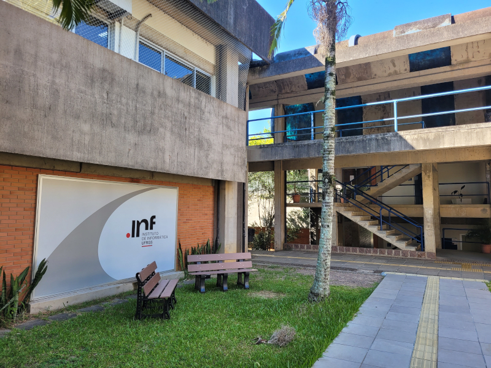
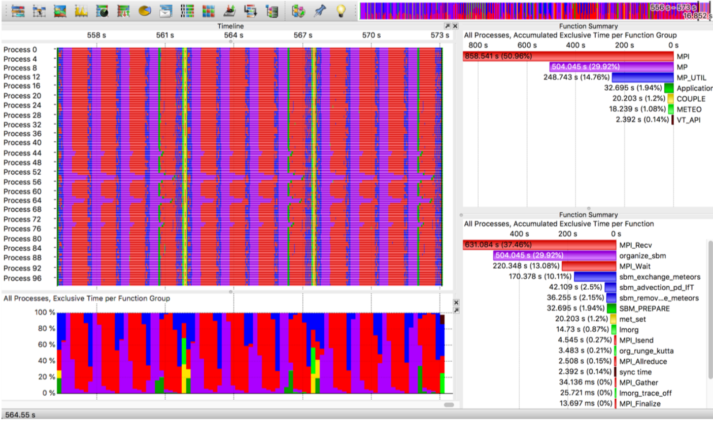
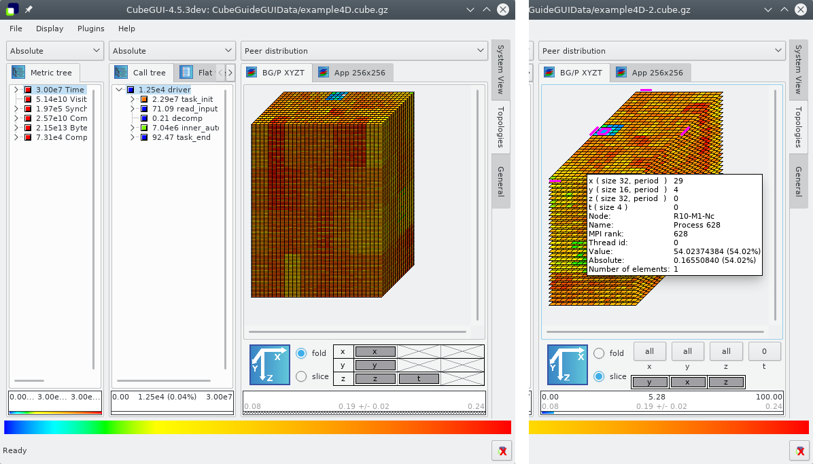
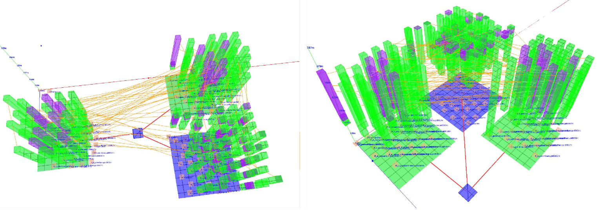
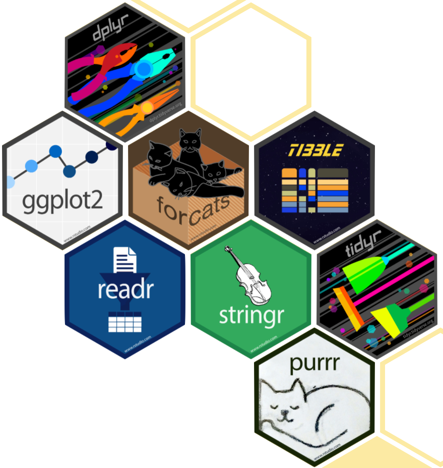

# -*- coding: utf-8 -*-
# -*- mode: org -*-
#+startup: beamer overview indent

#+TITLE: Trace visualization with StarVZ
#+AUTHOR: Lucas Mello Schnorr, UFRGS
#+EMAIL: schnorr@inf.ufrgs.br
#+DATE: 

#+LaTeX_CLASS: beamer
#+LaTeX_CLASS_OPTIONS: [10pt, xcolor=dvipsnames]
#+BEAMER_THEME: metropolis [numbering=fraction]
#+OPTIONS:   H:2 num:t toc:nil \n:nil @:t ::t |:t ^:t -:t f:t *:t <:t title:nil
#+LANGUAGE: en
#+TAGS: noexport(n) ignore(i)
#+EXPORT_EXCLUDE_TAGS: noexport
#+EXPORT_SELECT_TAGS: export
#+begin_export latex
\institute{
\\\bigskip
\textbf{Journée thématique Analyse de performance \\
Inria Saclay, batiment Turing, salle Gilles Kahn \\
Palaiseau, France, June 22nd, 2026\\\vspace{1cm} \\
\includegraphics[scale=0.12]{./logo/inf-logo-1.0.pdf}\hfill%
\includegraphics[scale=0.17]{./logo/ufrgs.pdf}\hfill%
\includegraphics[scale=0.3]{./logo/inria.pdf}%
}}
#+end_export
#+LATEX_HEADER: \usepackage{multicol}
#+LATEX_HEADER: \usepackage{subcaption}
#+LATEX_HEADER: \usepackage[backend=bibtex]{biblatex}
#+LATEX_HEADER: \bibliography{refs.bib}
#+LATEX_HEADER: \usepackage[T1]{fontenc}
#+LATEX_HEADER: \usepackage{palatino}
#+LATEX_HEADER: %\usepackage{enumitem}
#+LATEX_HEADER: %\setlist[itemize]{leftmargin=1.2em}
#+LATEX_HEADER: %O\input{org-babel.tex}
#+LATEX_HEADER: \AtBeginDocument{
#+LATEX_HEADER:   \definecolor{pdfurlcolor}{rgb}{0,0,0.6}
#+LATEX_HEADER:   \definecolor{pdfcitecolor}{rgb}{0,0.6,0}
#+LATEX_HEADER:   \definecolor{pdflinkcolor}{rgb}{0.6,0,0}
#+LATEX_HEADER:   \definecolor{light}{gray}{.85}
#+LATEX_HEADER:   \definecolor{vlight}{gray}{.95}
#+LATEX_HEADER: }
#+LATEX_HEADER: \usepackage{color,colortbl}
#+LATEX_HEADER: \definecolor{gray98}{rgb}{0.98,0.98,0.98}
#+LATEX_HEADER: \definecolor{gray20}{rgb}{0.20,0.20,0.20}
#+LATEX_HEADER: \definecolor{gray25}{rgb}{0.25,0.25,0.25}
#+LATEX_HEADER: \definecolor{gray16}{rgb}{0.161,0.161,0.161}
#+LATEX_HEADER: \definecolor{gray60}{rgb}{0.6,0.6,0.6}
#+LATEX_HEADER: \definecolor{gray30}{rgb}{0.3,0.3,0.3}
#+LATEX_HEADER: \definecolor{bgray}{RGB}{248, 248, 248}
#+LATEX_HEADER: \definecolor{amgreen}{RGB}{77, 175, 74}
#+LATEX_HEADER: \definecolor{amblu}{RGB}{55, 126, 184}
#+LATEX_HEADER: \definecolor{amred}{RGB}{228,26,28}
#+LATEX_HEADER: \usepackage[procnames]{listings}
#+LATEX_HEADER: \lstset{ %
#+LATEX_HEADER:  backgroundcolor=\color{gray98},    % choose the background color; you must add \usepackage{color} or \usepackage{xcolor}
#+LATEX_HEADER:  basicstyle=\tt\prettysmall,      % the size of the fonts that are used for the code
#+LATEX_HEADER:  breakatwhitespace=false,          % sets if automatic breaks should only happen at whitespace
#+LATEX_HEADER:  breaklines=true,                  % sets automatic line breaking
#+LATEX_HEADER:  showlines=true,                  % sets automatic line breaking
#+LATEX_HEADER:  captionpos=b,                     % sets the caption-position to bottom
#+LATEX_HEADER:  commentstyle=\color{gray30},      % comment style
#+LATEX_HEADER:  extendedchars=true,               % lets you use non-ASCII characters; for 8-bits encodings only, does not work with UTF-8
#+LATEX_HEADER:  frame=single,                     % adds a frame around the code
#+LATEX_HEADER:  keepspaces=true,                  % keeps spaces in text, useful for keeping indentation of code (possibly needs columns=flexible)
#+LATEX_HEADER:  keywordstyle=\color{amblu},       % keyword style
#+LATEX_HEADER:  procnamestyle=\color{amred},       % procedures style
#+LATEX_HEADER:  language=C,             % the language of the code
#+LATEX_HEADER:  numbers=none,                     % where to put the line-numbers; possible values are (none, left, right)
#+LATEX_HEADER:  numbersep=5pt,                    % how far the line-numbers are from the code
#+LATEX_HEADER:  numberstyle=\tiny\color{gray20}, % the style that is used for the line-numbers
#+LATEX_HEADER:  rulecolor=\color{gray20},          % if not set, the frame-color may be changed on line-breaks within not-black text (e.g. comments (green here))
#+LATEX_HEADER:  showspaces=false,                 % show spaces everywhere adding particular underscores; it overrides 'showstringspaces'
#+LATEX_HEADER:  showstringspaces=false,           % underline spaces within strings only
#+LATEX_HEADER:  showtabs=false,                   % show tabs within strings adding particular underscores
#+LATEX_HEADER:  stepnumber=2,                     % the step between two line-numbers. If it's 1, each line will be numbered
#+LATEX_HEADER:  stringstyle=\color{amdove},       % string literal style
#+LATEX_HEADER:  tabsize=2,                        % sets default tabsize to 2 spaces
#+LATEX_HEADER:  % title=\lstname,                    % show the filename of files included with \lstinputListing; also try caption instead of title
#+LATEX_HEADER:  procnamekeys={call}
#+LATEX_HEADER: }
#+LATEX_HEADER: \newcommand{\prettysmall}{\fontsize{6}{8}\selectfont}
#+LATEX_HEADER: \newcommand{\quitesmall}{\fontsize{8}{10}\selectfont}

# You need at least Org 9 and Emacs 24 to make this work.

#+LATEX: {
#+LATEX: \maketitle
#+LATEX: }

* Promo                                                            :noexport:
** Additional items to add                                :noexport:
- [X] Slides about HPC@UFRGS
- [X] Research scope
- [X] Computational Platform
- [ ] Control Methods
** Institute of Informatics in Porto Alegre (RS)

Overview of *Porto Alegre* in October, from Morro da Glória, 287m
#+latex: \vspace{-.2cm}
#+attr_latex: :width \linewidth

#+latex: \pause

View of the historic center of *Porto Alegre*, from the level of Guaíba
#+latex: \vspace{-.2cm}
#+attr_latex: :width \linewidth
[[./img/guaiba.jpg]]

#+latex: \pause

#+latex: \vspace{-5cm}
#+attr_latex: :width .93\linewidth

#+BEGIN_CENTER
View of the gardens of the *Institute of Informatics*, in February.
#+END_CENTER

** Graduate Program in Computing (PPGC)

Program website: http://www.inf.ufrgs.br/ppgc/

#+attr_latex: :width .2\linewidth

Offers
- _Master's_, semester intakes
  - For those wanting scholarships, take the Poscomp exam (from SBC)
- _Ph.D._, continuous enrollment

#+latex: \vfill\pause

Notable facts
- Maximum rating (7) from CAPES
- Internationalization of education and research

** GPPD - Parallel and Distributed Processing Group

Research group website:

http://www.inf.ufrgs.br/gppd/site/

Research group logo

#+attr_latex: :width .4\linewidth
[[./img/gppd-logo.png]]

Main research axes
- *High Performance Computing*
- Computer Architecture
- Performance Analysis
- Cloud Computing

** High Performance Computing Cluster (PCAD)

URL: http://pcad.inf.ufrgs.br/

Possesses \approx50 nodes, \approx1000+ CPU cores and \approx100000+ GPUs

#+attr_latex: :width .75\linewidth
[[./img/20240819_104551.jpg]]

Location: /Data Center/ of the Institute of Informatics, UFRGS

We have a GT (Working Group)
- We train students in the management of these platforms
- SLURM, NFS, LDAP, ...

** Who am I?
*** Lucas Mello Schnorr
:PROPERTIES:
:BEAMER_col: 0.45
:BEAMER_opt: [t]
:BEAMER_env: block
:END:

#+latex: \bigskip

Prof. INF/UFRGS & PPGC

[[http://www.inf.ufrgs.br/~schnorr][http://www.inf.ufrgs.br/~schnorr]]

schnorr@inf.ufrgs.br

#+attr_latex: :width .5\linewidth
[[./img/lucas-schnorr.png]]

*** Education
:PROPERTIES:
:BEAMER_col: 0.45
:BEAMER_opt: [t]
:BEAMER_env: block
:END:

Computer Science
- B.S. UFSM (2003)
- M.S. UFRGS (2005)
- Ph.D. UFRGS co-tutelage at INPG, Grenoble, France (2009)
- Post-doctoral at CNRS (2010 -- 2012)
- Post-doctoral at Inria (2016/2017)

* Introduction
** Performance Analysis in HPC: typical objectives

Main objectives of performance analysis
 
#+latex: \vfill\pause
 
Understand application behavior
- Identify performance *bottlenecks* (CPU, memory, network, I/O)
- Understand *comm.* patterns between processes and threads
- Evaluate the use of available *computational resources*
 
#+latex: \vfill\pause
 
Guide optimization
- Focus efforts on parts with the *greatest impact* (/hotspots/)
- Validate the effect of *code modifications*
- Support *scheduling* and execution configuration decisions
 
#+latex: \vfill\pause
 
Ensure quality and reproducibility
- Produce *reproducible* and verifiable analyses
- Compare performance across different *platforms*
- Generate evidence for *scientific publications*

** Performance Analysis in HPC: the problem

Performance analysis is *essential* for efficient resource usage

#+latex: \vfill\pause

Traditional approach: *monolithic* tools
- Limited analytical *expressiveness*
- Low *extensibility* and adaptability
- Difficulty integrating with modern analysis workflows

** Some examples: Vampir 1/4

#+attr_latex: :width \linewidth

#+latex: {\scriptsize
Williams, William, and Holger Brunst. "Parallel performance
engineering using Score-P and Vampir." Companion of the 2023 ACM/SPEC
International Conference on Performance Engineering. 2023.
#+latex: }

** Some examples: Scalasca Cube 2/4

#+attr_latex: :width \linewidth

#+latex: {\scriptsize
Zhukov, Ilya, et al. "Scalasca v2: Back to the future." Tools for High
Performance Computing 2014: Proceedings of the 8th International
Workshop on Parallel Tools for High Performance Computing, October
2014, HLRS, Stuttgart, Germany. Cham: Springer International
Publishing, 2015.
#+latex: }

** Some examples: Triva 3/4

#+attr_latex: :width \linewidth

#+latex: {\scriptsize
Schnorr, Lucas Mello, Guillaume Huard, and Philippe OA Navaux. "Triva:
Interactive 3d visualization for performance analysis of parallel
applications." Future Generation Computer Systems 26.3 (2010):
348-358.
#+latex: }

** Some examples: Paje 4/4

#+attr_latex: :width \linewidth
[[./img/paje.png]]

#+latex: {\scriptsize
Flexible performance visualization of parallel and distributed
applications.  J. Chassin de Kergommeaux, B. de Oliveira Stein Future
Generation Computer Systems 19 (2003) 735-747.
#+latex: }

** Performance Analysis in HPC: the consequences

#+begin_export latex
\includegraphics[width=.23\linewidth]{./img/vampir.png}\hfill%
\includegraphics[width=.23\linewidth]{./img/scalasca-cube.png}\hfill%
\includegraphics[width=.23\linewidth]{./img/triva.png}\hfill%
\includegraphics[width=.23\linewidth]{./img/paje.png}
#+end_export

#+latex: \vfill

- Limited analysis of *execution traces* and performance profiles
- Slow optimization cycle
- Difficulty performing automations
  - For example via LLMs or SLMs
  - Or even via traditional code analysis methods
- Poorly reproducible
  - We don't have the ``source code'' of each specific view

** Data Science + [possibly?] LLMs as a modern alternative

Emergence of *data science* and *big data* tools

#+latex: \vfill\pause

New possibilities
- Expressive and flexible analysis of *execution traces*
- Support for a huge variety of application types
  - Traditional Bulk-Synchronous Parallel (BSP, MPI, MPI+X)
  - *Task-based* (StarPU, Parsec, OpenMP tasks)
- Handling *scalability* challenges
  - Huge volume of traced data

#+latex: \vfill\pause

Beyond performance analysis
- *Reproducibility* of experiments and analyses
- *Scientific transparency* in results

** Outline

# 1. Review task parallelism operation
#    - /Sequential Task Flow/ (STF) with the StarPU runtime
2. Present the StarVZ R package
   - R-Based Visualization Techniques for Task-Based Applications
   - https://cran.r-project.org/web/packages/starvz/
3. Some recent usage examples

* StarVZ
** Task Parallelism in StarPU                                     :noexport:

Applications are represented as task graphs
- Application code is sequential (/Sequential Task Flow/ -- STF)

Example: Block Cholesky factorization

#+BEGIN_EXPORT LaTeX
\definecolor{dpotrfcolor}{rgb}{0.8675,0,0}
\definecolor{dgemmcolor}{rgb}{0,0.5625,0}
\definecolor{dsyrkcolor}{rgb}{0.5625,0,0.5625}
\definecolor{dtrsmcolor}{rgb}{0,0,0.8675}
\begin{columns}\begin{column}{.55\linewidth}\small
\lstset{frame=bt,numbers=none,basicstyle=\tt\quitesmall,numberstyle=\tt\prettysmall,escapechar=|}\lstinputlisting{cholesky.c}%
\end{column}\begin{column}{.45\linewidth}
\includegraphics[width=\linewidth]{img/dag-5x5-crop.pdf}
\end{column}\end{columns}
#+END_EXPORT

#+latex: \pause

A runtime (StarPU) is responsible for task scheduling
- Respects dependencies, moves data around

** StarVZ: visualization of task parallelism traces

Features
- /Post-mortem/ analysis, after the parallel application finishes
- Has a series of visualization panels
- Fully based on the R/tidyverse analysis framework

*** Left                                                            :BMCOL:
:PROPERTIES:
:BEAMER_col: 0.38
:END:

#+attr_latex: :width \linewidth

*** Right                                                           :BMCOL:
:PROPERTIES:
:BEAMER_col: 0.65
:END:

- Collection of packages \to data science
- Share philosophy and grammar

*** Unico                                                 :B_ignoreheading:
:PROPERTIES:
:BEAMER_env: ignoreheading
:END:

#+latex: {\scriptsize
A Visual Performance Analysis Framework for Task-based Parallel Applications running on Hybrid Clusters, Vinicius Garcia Pinto, Lucas Mello Schnorr, Luka Stanisic, Arnaud Legrand, Samuel Thibault, Vincent Danjean, in Concurrency and Computation: Practice and Experience, Wiley, 2018, 30 (18), pp.1-31.
#+latex: }

** StarVZ: Phase 1

1. StarPU application is executed, generates =prof_file_X= files
   - Binary files (concern for low intrusiveness)
2. We run =starpu_fxt_tool=, a tool for exporting
3. We then run phase #1 of StarVZ
   - On the cluster \to generate fast-read files
   
#+attr_latex: :width \linewidth
[[./img/r_analysis_workflow_offline_phase.pdf]]

** StarVZ: Phase 2

1. Data is typically brought to the Laptop
2. Fast reading of data in =parquet= format
3. Visualization panels, option to work directly with tables
   - Build your own analysis /script/

#+attr_latex: :width \linewidth
[[./img/r_analysis_workflow_online_phase.pdf]]

* Usage examples
** Sparse QR-Mumps Matrix Factorization 1/2

https://qr_mumps.gitlab.io/

Elimination tree to guide the factorization process
#+attr_latex: :width .9\linewidth
[[./img/qrmumps-basics.jpg]]

#+latex: {\scriptsize
Miletto, Marcelo Cogo, et al. "Performance analysis of task-based
multi-frontal sparse linear solvers: Structure matters." Future
Generation Computer Systems 135 (2022): 409-425.
#+latex: }

** Sparse QR-Mumps Matrix Factorization 2/2

#+attr_latex: :width .8\linewidth
[[./img/qrmumps-panels.jpg]]

** Cluster applications with ExaGeoStat on StarPU-MPI

https://github.com/ecrc/exageostat

#+attr_latex: :width \linewidth
[[./img/nesi-async.png]]

#+latex: {\scriptsize
Asynchronous multi-phase task-based applications: Employing different
nodes to design better distributions. Future Gener. Comput. Syst. 147:
119-135 (2023)
#+latex: }

** StarPU /versus/ OpenMP comparison                                :noexport:

* Conclusion
** Conclusions
*** Specific performance analysis per application          :B_exampleblock:
:PROPERTIES:
:BEAMER_env: exampleblock
:END:

- Communication/computation overlap (MPI, CUDA)
- Identification of idle time reasons
- Identify scheduling delays
- *Give analysts the freedom to test /what-if/ scenarios*

#+latex: \pause

*** Clear separation between tracing and analysis       :B_exampleblock:
:PROPERTIES:
:BEAMER_env: exampleblock
:END:

- Using open formats and tools
- Allow the use of data science techniques
  - Efficient in-memory read formats
  - Use acceleration frameworks (RAPIDS, PySpark)

#+latex: \pause

*** Favor the use of LLMs/SLMs                         :B_exampleblock:
:PROPERTIES:
:BEAMER_env: exampleblock
:END:

- Construction of analysis code snippets

** Contact
*** Contact                                                          :BMCOL:
:PROPERTIES:
:BEAMER_col: 0.5
:END:

#+begin_center
Thank you for your attention!

Thanks for the VISTA EA Team
#+end_center

#+begin_center
schnorr@inf.ufrgs.br
#+end_center

*** QrCode                                                           :BMCOL:
:PROPERTIES:
:BEAMER_col: 0.3
:END:
#+attr_latex: :width \linewidth
[[./img/qrcode.png]]

* EMACS Configuration                                            :noexport:
** Manual

#+begin_src emacs-lisp :results output :session :exports both
(add-to-list 'load-path ".")
(require 'ox-extra)
(ox-extras-activate '(ignore-headlines))
(setq ispell-local-dictionary "brasileiro")
(flyspell-mode t)

(setq org-latex-listings 'minted
      org-latex-packages-alist '(("" "minted"))
      org-latex-pdf-process
      '("pdflatex -shell-escape -interaction nonstopmode -output-directory %o %f"
        "pdflatex -shell-escape -interaction nonstopmode -output-directory %o %f"))
(setq org-latex-minted-options
       '(("frame" "lines")
         ("fontsize" "\\scriptsize")))
#+end_src

#+RESULTS:

** Local

# Local Variables:
# eval: (add-to-list 'load-path ".")
# eval: (require 'ox-extra)
# eval: (ox-extras-activate '(ignore-headlines))
# eval: (setq org-latex-listings t)
# eval: (setq org-latex-packages-alist '(("" "listings")))
# eval: (setq org-latex-packages-alist '(("" "listingsutf8")))
# eval: (setq org-latex-listings 'minted)
# eval: (setq org-latex-packages-alist '(("" "minted")))
# eval: (setq org-latex-pdf-process '("pdflatex -shell-escape -interaction nonstopmode -output-directory %o %f" "pdflatex -shell-escape -interaction nonstopmode -output-directory %o %f")))
# eval: (setq org-latex-minted-options '(("frame" "lines") ("fontsize" "\\scriptsize")))
# End:
