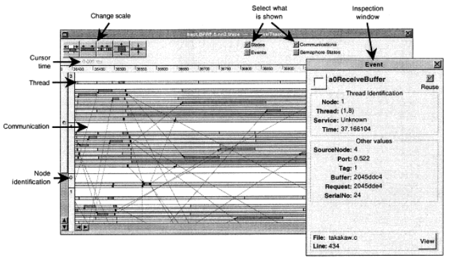
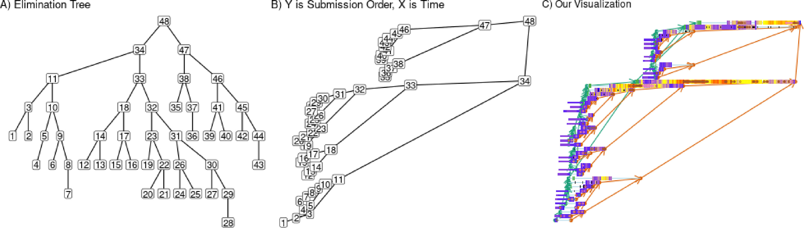
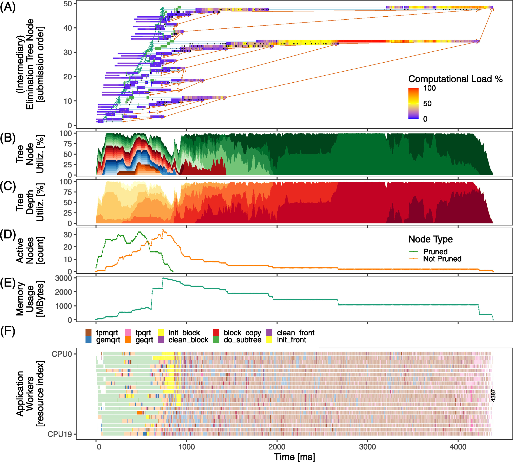
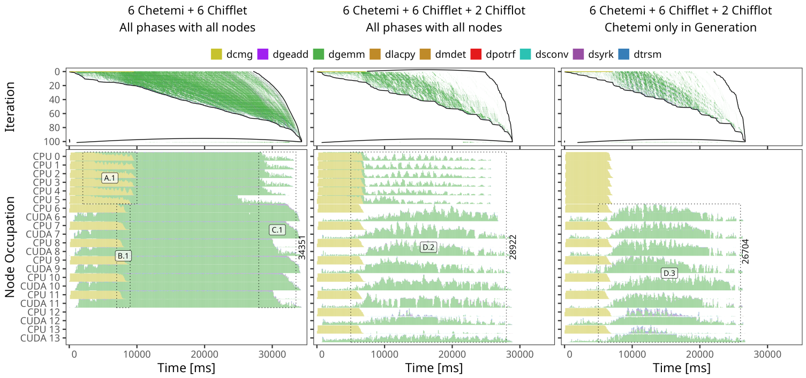

# -*- coding: utf-8 -*-
# -*- mode: org -*-
#+startup: beamer overview indent

#+TITLE: Ciência de Dados para Análise de Desempenho de Aplicações HPC
#+AUTHOR: Lucas Mello Schnorr, UFRGS
#+EMAIL: schnorr@inf.ufrgs.br
#+DATE: 

#+LaTeX_CLASS: beamer
#+LaTeX_CLASS_OPTIONS: [10pt, xcolor=dvipsnames]
#+BEAMER_THEME: metropolis [numbering=fraction]
#+OPTIONS:   H:2 num:t toc:nil \n:nil @:t ::t |:t ^:t -:t f:t *:t <:t title:nil
#+LANGUAGE: pt-br
#+TAGS: noexport(n) ignore(i)
#+EXPORT_EXCLUDE_TAGS: noexport
#+EXPORT_SELECT_TAGS: export
#+begin_export latex
\institute{
\\\bigskip
\textbf{Núcleo de Processamento de Alto Desempenho (NPAD) \\
Universidade Federal do Rio Grande do Norte (UFRN) \\
Natal - RN, 10 de junho de 2026\\\vspace{1cm}
\includegraphics[scale=0.12]{./logo/inf-logo-1.0.pdf}\hspace{2cm}%
\includegraphics[scale=0.17]{./logo/ufrgs.pdf}%
}}
#+end_export
#+LATEX_HEADER: \usepackage{multicol}
#+LATEX_HEADER: \usepackage{subcaption}
#+LATEX_HEADER: \usepackage[backend=bibtex]{biblatex}
#+LATEX_HEADER: \bibliography{refs.bib}
#+LATEX_HEADER: \usepackage[T1]{fontenc}
#+LATEX_HEADER: \usepackage{palatino}
#+LATEX_HEADER: %\usepackage{enumitem}
#+LATEX_HEADER: %\setlist[itemize]{leftmargin=1.2em}
#+LATEX_HEADER: %O\input{org-babel.tex}
#+LATEX_HEADER: \AtBeginDocument{
#+LATEX_HEADER:   \definecolor{pdfurlcolor}{rgb}{0,0,0.6}
#+LATEX_HEADER:   \definecolor{pdfcitecolor}{rgb}{0,0.6,0}
#+LATEX_HEADER:   \definecolor{pdflinkcolor}{rgb}{0.6,0,0}
#+LATEX_HEADER:   \definecolor{light}{gray}{.85}
#+LATEX_HEADER:   \definecolor{vlight}{gray}{.95}
#+LATEX_HEADER: }
#+LATEX_HEADER: \usepackage{color,colortbl}
#+LATEX_HEADER: \definecolor{gray98}{rgb}{0.98,0.98,0.98}
#+LATEX_HEADER: \definecolor{gray20}{rgb}{0.20,0.20,0.20}
#+LATEX_HEADER: \definecolor{gray25}{rgb}{0.25,0.25,0.25}
#+LATEX_HEADER: \definecolor{gray16}{rgb}{0.161,0.161,0.161}
#+LATEX_HEADER: \definecolor{gray60}{rgb}{0.6,0.6,0.6}
#+LATEX_HEADER: \definecolor{gray30}{rgb}{0.3,0.3,0.3}
#+LATEX_HEADER: \definecolor{bgray}{RGB}{248, 248, 248}
#+LATEX_HEADER: \definecolor{amgreen}{RGB}{77, 175, 74}
#+LATEX_HEADER: \definecolor{amblu}{RGB}{55, 126, 184}
#+LATEX_HEADER: \definecolor{amred}{RGB}{228,26,28}
#+LATEX_HEADER: \usepackage[procnames]{listings}
#+LATEX_HEADER: \lstset{ %
#+LATEX_HEADER:  backgroundcolor=\color{gray98},    % choose the background color; you must add \usepackage{color} or \usepackage{xcolor}
#+LATEX_HEADER:  basicstyle=\tt\prettysmall,      % the size of the fonts that are used for the code
#+LATEX_HEADER:  breakatwhitespace=false,          % sets if automatic breaks should only happen at whitespace
#+LATEX_HEADER:  breaklines=true,                  % sets automatic line breaking
#+LATEX_HEADER:  showlines=true,                  % sets automatic line breaking
#+LATEX_HEADER:  captionpos=b,                     % sets the caption-position to bottom
#+LATEX_HEADER:  commentstyle=\color{gray30},      % comment style
#+LATEX_HEADER:  extendedchars=true,               % lets you use non-ASCII characters; for 8-bits encodings only, does not work with UTF-8
#+LATEX_HEADER:  frame=single,                     % adds a frame around the code
#+LATEX_HEADER:  keepspaces=true,                  % keeps spaces in text, useful for keeping indentation of code (possibly needs columns=flexible)
#+LATEX_HEADER:  keywordstyle=\color{amblu},       % keyword style
#+LATEX_HEADER:  procnamestyle=\color{amred},       % procedures style
#+LATEX_HEADER:  language=C,             % the language of the code
#+LATEX_HEADER:  numbers=none,                     % where to put the line-numbers; possible values are (none, left, right)
#+LATEX_HEADER:  numbersep=5pt,                    % how far the line-numbers are from the code
#+LATEX_HEADER:  numberstyle=\tiny\color{gray20}, % the style that is used for the line-numbers
#+LATEX_HEADER:  rulecolor=\color{gray20},          % if not set, the frame-color may be changed on line-breaks within not-black text (e.g. comments (green here))
#+LATEX_HEADER:  showspaces=false,                 % show spaces everywhere adding particular underscores; it overrides 'showstringspaces'
#+LATEX_HEADER:  showstringspaces=false,           % underline spaces within strings only
#+LATEX_HEADER:  showtabs=false,                   % show tabs within strings adding particular underscores
#+LATEX_HEADER:  stepnumber=2,                     % the step between two line-numbers. If it's 1, each line will be numbered
#+LATEX_HEADER:  stringstyle=\color{amdove},       % string literal style
#+LATEX_HEADER:  tabsize=2,                        % sets default tabsize to 2 spaces
#+LATEX_HEADER:  % title=\lstname,                    % show the filename of files included with \lstinputlisting; also try caption instead of title
#+LATEX_HEADER:  procnamekeys={call}
#+LATEX_HEADER: }
#+LATEX_HEADER: \newcommand{\prettysmall}{\fontsize{6}{8}\selectfont}
#+LATEX_HEADER: \newcommand{\quitesmall}{\fontsize{8}{10}\selectfont}

# You need at least Org 9 and Emacs 24 to make this work.

#+LATEX: {
#+LATEX: \maketitle
#+LATEX: }

* Dados                                                            :noexport:
** Título
Ciência de Dados para Análise de Desempenho de Aplicações HPC
** Resumo

Historicamente a análise de desempenho de aplicações HPC tem sido
realizadas com ferramentas monolíticas com pouca capacidade de
expressão e extensão. Em um passado mais recente, surgem várias
ferramentas que permitem empregar ferramentas de ciência de dados e
big data para a análise de rastros de execução e perfis de desempenho
de aplicações HPC. Esta palestra apresentará o ambiente de análise de
desempenho do StarVZ especialmente desenvolvimento para aplicações
baseadas em tarefas (StarPU, Parsec, OpenMP) e desafios de
escalabilidade. A apresentação dialoga também com mecanismos de
análise de dados reprodutíveis e de transparência científica.

* Propaganda
** Coisas adicionais por adicionar                                :noexport:
- [X] Slides sobre o HPC@UFRGS
- [X] Perímetros de investigação
- [X] Plataforma Computacional
- [ ] Formas de Controle
** Instituto de Informática em Porto Alegre (RS)

Vista geral de *Porto Alegre* em outubro, do Morro da Glória, 287m
#+latex: \vspace{-.2cm}
#+attr_latex: :width \linewidth
[[./img/poa.jpg]]

#+latex: \pause

Vista do centro histórico de *Porto Alegre*, do nível do Guaíba
#+latex: \vspace{-.2cm}
#+attr_latex: :width \linewidth

#+latex: \pause

#+latex: \vspace{-5cm}
#+attr_latex: :width .93\linewidth
[[./img/20260206_092341_fixed.jpg]]

#+BEGIN_CENTER
Vista dos jardins do *Instituto de Informática*, em fevereiro.
#+END_CENTER

** Programa de Pós-Graduação em Computação (PPGC)

Site do programa: http://www.inf.ufrgs.br/ppgc/

#+attr_latex: :width .2\linewidth
[[./img/logo-ppgc-187x118.png]]

Oferece
- _Mestrado_, entradas semestrais
  - Para quem quer bolsa, fazer o Poscomp (da SBC)
- _Doutorado_, entrada com fluxo continuo

#+latex: \vfill\pause

Fatos marcantes
- Conceito máximo (7) pela CAPES
- Internacionalização da formação e da investigação

** GPPD - Grupo de Processamento Paralelo e Distribuído

Site do grupo de pesquisa:

http://www.inf.ufrgs.br/gppd/site/

Logo do grupo de pesquisa

#+attr_latex: :width .4\linewidth
[[./img/gppd-logo.png]]

Eixos principais de investigação
- *High Performance Computing*
- Computer Architecture
- Performance Analysis
- Cloud Computing

** Parque Computacional de Alto Desempenho (PCAD)

URL: http://pcad.inf.ufrgs.br/

Possui \approx50 nós, \approx1000+ núcleos de CPU e \approx100000+ de GPU

#+attr_latex: :width .75\linewidth
[[./img/20240819_104551.jpg]]

Localização: /Data Center/ do Instituto de Informática, UFRGS

Temos um GT (Grupo de Trabalho)
- Formamos alunos no gerenciamento destas plataformas
- SLURM, NFS, LDAP, ...

** Quem sou eu?
*** Lucas Mello Schnorr
:PROPERTIES:
:BEAMER_col: 0.45
:BEAMER_opt: [t]
:BEAMER_env: block
:END:

#+latex: \bigskip

Prof. INF/UFRGS & PPGC

[[http://www.inf.ufrgs.br/~schnorr][http://www.inf.ufrgs.br/~schnorr]]

schnorr@inf.ufrgs.br

#+attr_latex: :width .5\linewidth

*** Formação
:PROPERTIES:
:BEAMER_col: 0.45
:BEAMER_opt: [t]
:BEAMER_env: block
:END:

Ciência da Computação
- Graduação UFSM (2003)
- Mestrado UFRGS (2005)
- Doutorado UFRGS co-tutela no INPG, Grenoble, França (2009)
- Pós-doutorado no CNRS (2010 -- 2012)
- Pós-doutorado no Inria (2016/2017)

* Introdução
** Análise de Desempenho em HPC: objetivos típicos

Objetivos principais da análise de desempenho
 
#+latex: \vfill\pause
 
Compreender o comportamento da aplicação
- Identificar *gargalos* de desempenho (CPU, memória, rede, I/O)
- Entender padrões de *comunicação* entre processos e threads
- Avaliar o uso dos *recursos computacionais* disponíveis
 
#+latex: \vfill\pause
 
Guiar a otimização
- Direcionar esforços para as partes de *maior impacto* (/hotspots/)
- Validar o efeito de *modificações* no código
- Apoiar decisões de *escalonamento* e configuração de execução
 
#+latex: \vfill\pause
 
Garantir qualidade e reprodutibilidade
- Produzir análises *reprodutíveis* e verificáveis
- Comparar desempenho entre diferentes *plataformas*
- Gerar evidências para *publicações* científicas

** Análise de Desempenho em HPC: o problema

Análise de desempenho de aplicações HPC é *essencial* para uso eficiente dos recursos

#+latex: \vfill\pause

Abordagem tradicional: ferramentas *monolíticas*
- Pouca capacidade de *expressão* analítica
- Baixa capacidade de *extensão* e adaptação
- Dificuldade de integração com fluxos modernos de análise

** Alguns exemplos: Vampir 1/4

#+attr_latex: :width \linewidth
[[./img/vampir.png]]

#+latex: {\scriptsize
Williams, William, and Holger Brunst. "Parallel performance
engineering using Score-P and Vampir." Companion of the 2023 ACM/SPEC
International Conference on Performance Engineering. 2023.
#+latex: }

** Alguns exemplos: Scalasca Cube 2/4

#+attr_latex: :width \linewidth
[[./img/scalasca-cube.png]]

#+latex: {\scriptsize
Zhukov, Ilya, et al. "Scalasca v2: Back to the future." Tools for High
Performance Computing 2014: Proceedings of the 8th International
Workshop on Parallel Tools for High Performance Computing, October
2014, HLRS, Stuttgart, Germany. Cham: Springer International
Publishing, 2015.
#+latex: }

** Alguns exemplos: Triva 3/4

#+attr_latex: :width \linewidth
[[./img/triva.png]]

#+latex: {\scriptsize
Schnorr, Lucas Mello, Guillaume Huard, and Philippe OA Navaux. "Triva:
Interactive 3d visualization for performance analysis of parallel
applications." Future Generation Computer Systems 26.3 (2010):
348-358.
#+latex: }

** Alguns exemplos: Paje 4/4

#+attr_latex: :width \linewidth

#+latex: {\scriptsize
Flexible performance visualization of parallel and distributed
applications.  J. Chassin de Kergommeaux, B. de Oliveira Stein Future
Generation Computer Systems 19 (2003) 735-747.
#+latex: }

** Análise de Desempenho em HPC: as consequências

#+begin_export latex
\includegraphics[width=.23\linewidth]{./img/vampir.png}\hfill%
\includegraphics[width=.23\linewidth]{./img/scalasca-cube.png}\hfill%
\includegraphics[width=.23\linewidth]{./img/triva.png}\hfill%
\includegraphics[width=.23\linewidth]{./img/paje.png}
#+end_export

#+latex: \vfill

- Análise limitada de *rastros de execução* e perfis de desempenho
- Ciclo de otimização lento
- Dificuldade de realizar automações
  - Por exemplo via LLMs ou SLMs
  - Ou até via métodos tradicionais de código de análise
- Pouco reprodutível
  - Não temos o ``código fonte'' de cada visão específica

** Ciência de Dados como Solução

Surgimento de ferramentas de *ciência de dados* e *big data*

#+latex: \vfill\pause

Novas possibilidades
- Análise expressiva e flexível de *rastros de execução*
- Suporte a uma variedade gigante de tipos de aplicações
  - Tradicional Bulk-Synchronous Parallel (BSP, MPI, MPI+X)
  - Baseadas em *tarefas* (StarPU, Parsec, OpenMP tasks)
- Tratamento de desafios de *escalabilidade*
  - Enorme volume de dados rastreados

#+latex: \vfill\pause

Além da análise de desempenho
- *Reprodutibilidade* dos experimentos e análises
- *Transparência científica* nos resultados

** Plano

1. Revisar o funcionamento do paralelismo de tarefas
   - /Sequential Task Flow/ (STF) com o runtime StarPU
2. Apresentar o pacote R =StarVZ=
   - R-Based Visualization Techniques for Task-Based Applications
   - https://cran.r-project.org/web/packages/starvz/
3. Alguns exemplos recentes de uso

* StarVZ
** Paralelismo de Tarefas no StarPU

Aplicações são representadas por grafo de tarefas
- Código da aplicação é sequencial (/Sequential Task Flow/ -- STF)

Exemplo: Fatorização de cholesky por blocos

#+BEGIN_EXPORT LaTeX
\definecolor{dpotrfcolor}{rgb}{0.8675,0,0}
\definecolor{dgemmcolor}{rgb}{0,0.5625,0}
\definecolor{dsyrkcolor}{rgb}{0.5625,0,0.5625}
\definecolor{dtrsmcolor}{rgb}{0,0,0.8675}
\begin{columns}\begin{column}{.55\linewidth}\small
\lstset{frame=bt,numbers=none,basicstyle=\tt\quitesmall,numberstyle=\tt\prettysmall,escapechar=|}\lstinputlisting{cholesky.c}%
\end{column}\begin{column}{.45\linewidth}
\includegraphics[width=\linewidth]{img/dag-5x5-crop.pdf}
\end{column}\end{columns}
#+END_EXPORT

#+latex: \pause

Um /runtime/ (StarPU) é responsável pelo escalonamento das tarefas
- Respeita as dependências, faz dados trafegarem

** StarVZ: visualização de rastros de paralelismo de tarefas

Características
- Análise /post-mortem/, após a finalização da aplicação paralela
- Possui uma série de paineis de visualização
- Totalmente baseado no framework de análise =R/tidyverse=

*** Left                                                            :BMCOL:
:PROPERTIES:
:BEAMER_col: 0.38
:END:

#+attr_latex: :width \linewidth
[[./img/tidyverse.png]]

*** Right                                                           :BMCOL:
:PROPERTIES:
:BEAMER_col: 0.65
:END:

- Coleção de pacotes \to ciência de dados
- Compartilham filosofia e gramática

*** Unico                                                 :B_ignoreheading:
:PROPERTIES:
:BEAMER_env: ignoreheading
:END:

#+latex: {\scriptsize
A Visual Performance Analysis Framework for Task-based Parallel Applications running on Hybrid Clusters, Vinicius Garcia Pinto, Lucas Mello Schnorr, Luka Stanisic, Arnaud Legrand, Samuel Thibault, Vincent Danjean, in Concurrency and Computation: Practice and Experience, Wiley, 2018, 30 (18), pp.1-31.
#+latex: }

** StarVZ: Phase 1

1. Aplicação StarPU é executada, gera arquivos =prof_file_X=
   - Arquivos binários (preocupação com baixa intrusividade)
2. Executamos =starpu_fxt_tool=, ferramenta para exportar
3. Executamos então a fase #1 do StarVZ
   - No cluster \to gerar arquivos de leitura rápida
   
#+attr_latex: :width \linewidth
[[./img/r_analysis_workflow_offline_phase.pdf]]

** StarVZ: Phase 2

1. Dados são normalmente trazidos para o Laptop
2. Leitura rápida dos dados em formato =parquet=
3. Paineis de visualização, opção de lidar direto com as tabelas
   - Construir seu próprio /script/ de análise

#+attr_latex: :width \linewidth
[[./img/r_analysis_workflow_online_phase.pdf]]

* Exemplos de uso
** Fatoração de matrizes esparsas QR-Mumps 1/2

https://qr_mumps.gitlab.io/

Árvore de eliminação para guiar o processo de fatoração
#+attr_latex: :width .9\linewidth

#+latex: {\scriptsize
Miletto, Marcelo Cogo, et al. "Performance analysis of task-based
multi-frontal sparse linear solvers: Structure matters." Future
Generation Computer Systems 135 (2022): 409-425.
#+latex: }

** Fatoração de matrizes esparsas QR-Mumps 2/2

#+attr_latex: :width .8\linewidth

** Aplicações em cluster com ExaGeoStat sobre StarPU-MPI

https://github.com/ecrc/exageostat

#+attr_latex: :width \linewidth

#+latex: {\scriptsize
Asynchronous multi-phase task-based applications: Employing different
nodes to design better distributions. Future Gener. Comput. Syst. 147:
119-135 (2023)
#+latex: }

** Comparação StarPU /versus/ OpenMP                                :noexport:

* Conclusão
** Conclusões
*** Análise de desempenho mais específica por aplicação    :B_exampleblock:
:PROPERTIES:
:BEAMER_env: exampleblock
:END:

- Sobreposição comunicação/cálculo (MPI, CUDA)
- Identificação das razões de ociosidade
- Identificar atrasos de escalonamento
- *Dar liberdade ao analista de testar cenários /what-if/*

#+latex: \pause

*** Separação clara entre o rastreamento e a análise       :B_exampleblock:
:PROPERTIES:
:BEAMER_env: exampleblock
:END:

- Usando formatos e ferramentas abertas
- Permitir emprego de técnicas de ciência de dados
  - Formatos eficientes de leitura /in-memory/
  - Usar frameworks de aceleração (RAPIDS, PySpark)

#+latex: \pause

*** Favorecer emprego de LLMs/SLMs                         :B_exampleblock:
:PROPERTIES:
:BEAMER_env: exampleblock
:END:

- Construção de code snippets de análise

** Contato
*** Contato                                                          :BMCOL:
:PROPERTIES:
:BEAMER_col: 0.5
:END:

#+begin_center
Obrigado pela atenção!
#+end_center

#+begin_center
schnorr@inf.ufrgs.br
#+end_center

*** QrCode                                                           :BMCOL:
:PROPERTIES:
:BEAMER_col: 0.3
:END:
#+attr_latex: :width \linewidth
[[./img/qrcode.png]]

* Configuração do EMACS                                            :noexport:
** Manual

#+begin_src emacs-lisp :results output :session :exports both
(add-to-list 'load-path ".")
(require 'ox-extra)
(ox-extras-activate '(ignore-headlines))
(setq ispell-local-dictionary "brasileiro")
(flyspell-mode t)

(setq org-latex-listings 'minted
      org-latex-packages-alist '(("" "minted"))
      org-latex-pdf-process
      '("pdflatex -shell-escape -interaction nonstopmode -output-directory %o %f"
        "pdflatex -shell-escape -interaction nonstopmode -output-directory %o %f"))
(setq org-latex-minted-options
       '(("frame" "lines")
         ("fontsize" "\\scriptsize")))
#+end_src

#+RESULTS:

** Local

# Local Variables:
# eval: (add-to-list 'load-path ".")
# eval: (require 'ox-extra)
# eval: (ox-extras-activate '(ignore-headlines))
# eval: (setq org-latex-listings t)
# eval: (setq org-latex-packages-alist '(("" "listings")))
# eval: (setq org-latex-packages-alist '(("" "listingsutf8")))
# eval: (setq org-latex-listings 'minted)
# eval: (setq org-latex-packages-alist '(("" "minted")))
# eval: (setq org-latex-pdf-process '("pdflatex -shell-escape -interaction nonstopmode -output-directory %o %f" "pdflatex -shell-escape -interaction nonstopmode -output-directory %o %f")))
# eval: (setq org-latex-minted-options '(("frame" "lines") ("fontsize" "\\scriptsize")))
# End:

