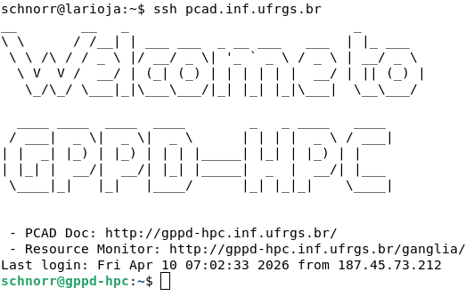

# -*- org-export-babel-evaluate: nil -*-
# -*- coding: utf-8 -*-
# -*- mode: org -*-
#+startup: beamer overview indent

#+TITLE: High Performance Computing Park (PCAD)
#+SUBTITLE:  Parallel and Distributed Processing Group (GPPD-HPC)
#+AUTHOR: Lucas Mello Schnorr
#+EMAIL: schnorr@inf.ufrgs.br
#+DATE: Institute of Informatics, UFRGS

#+LaTeX_CLASS: beamer
#+LaTeX_CLASS_OPTIONS: [10pt, presentation, aspectratio=169]
#+BEAMER_THEME: metropolis [numbering=fraction, progressbar=frametitle, sectionpage=none]
#+OPTIONS:   H:2 num:t toc:nil \n:nil @:t ::t |:t ^:t -:t f:t *:t <:t title:nil
#+LANGUAGE: en
#+TAGS: noexport(n) ignore(i)
#+EXPORT_EXCLUDE_TAGS: noexport
#+EXPORT_SELECT_TAGS: export

#+LATEX_HEADER: \usepackage[utf8]{inputenc}
#+LATEX_HEADER: \usepackage[T1]{fontenc}
#+LATEX_HEADER: \usepackage{palatino}
#+LATEX_HEADER: \usepackage{xspace}
#+LATEX_HEADER: \usepackage[font=tiny,labelfont=bf]{caption}
#+LATEX_HEADER: \captionsetup[figure]{labelformat=empty}%
#+LATEX_HEADER: \usepackage[absolute,overlay]{textpos}
#+LATEX_HEADER: \usepackage{listings}
#+LATEX_HEADER: \definecolor{mblue}{HTML}{005c8b} 
#+LATEX_HEADER: \definecolor{morange}{HTML}{f58431} 

#+begin_export latex
\institute{
\\\bigskip
\textbf{E.A.T. Meeting}\\
Administration Building, Institute of Physics, UFRGS\\
Porto Alegre, April 10, 2026, 14:00\\\bigskip

\includegraphics[scale=0.12]{./logo/inf-logo-1.0.pdf}\hspace{2cm}%
\includegraphics[scale=0.17]{./logo/ufrgs.pdf}%
}
#+end_export
# +LATEX_HEADER:\newcommand*{\DEBUG}{}%
#+LATEX_HEADER: \newcommand{\BC}{\textrm{BC}\xspace}
#+LATEX_HEADER: \newcommand{\BCH}{\textrm{1D$\times$1D}\xspace}
#+LATEX_HEADER: \newcommand{\BCHC}{\textrm{1D$\times$1D-C}\xspace}
#+LATEX_HEADER: \newcommand{\BCHCS}{\textrm{1D$\times$1D-C+S}\xspace}
#+LATEX_HEADER: \setlength{\TPHorizModule}{1mm}
#+LATEX_HEADER: \setlength{\TPVertModule}{1mm}
#+LATEX_HEADER: \usepackage{booktabs}

#+latex:\ifdefined\DEBUG
#+latex:\setbeamertemplate{background canvas}{
#+latex:\begin{tikzpicture}[remember picture,overlay]
#+latex:\node [draw, thick, shape=rectangle, minimum width=3cm, minimum height=4cm, anchor=center] at (14,-6.5) {};
#+latex:\filldraw (14,-6.5) node [below] {WebCam Debug} circle (1pt);
#+latex:\end{tikzpicture} 
#+latex:}
#+latex:\fi

#+latex: \setbeamerfont{title}{size=\large}
#+latex: \setbeamerfont{subtitle}{size=\small}

#+LATEX: \setbeamercolor{normal text}{% 
#+LATEX:   fg=mblue, 
#+LATEX:   bg=black!2 
#+LATEX: } 
 
#+LATEX: \setbeamercolor{alerted text}{%
#+LATEX:   fg=morange
#+LATEX: } 

#+latex: \setbeamercolor{background canvas}{bg=white}

#+LATEX: {
#+LATEX:  \maketitle
#+LATEX: }

# +LaTeX: \setbeamertemplate{footline}[text line]{%
# +LaTeX:   \parbox{\linewidth}{\vspace*{-8pt}\hspace{-1cm}\hfill ERAD/RS 2023 - DevOps para HPC: Como configurar um cluster para uso compartilhado \hfill\insertframenumber~/ \inserttotalframenumber}}
#+LaTeX:  \setbeamertemplate{navigation symbols}{}

#+LaTeX: \newcommand\boldblue[1]{\textcolor{erad20blue}{\textbf{#1}}}
#+LaTeX: \newcommand\itred[1]{\textcolor{red}{\textit{#1}}}
#+LaTeX: \definecolor{dpotrfcolor}{rgb}{0.8675,0,0}
#+LaTeX: \definecolor{dgemmcolor}{rgb}{0,0.5625,0}
#+LaTeX: \definecolor{dsyrkcolor}{rgb}{0.5625,0,0.5625}
#+LaTeX: \definecolor{dtrsmcolor}{rgb}{0,0,0.8675}
#+LATEX: \definecolor{thegray}{rgb}{0.95,0.95,0.95}

* Overview, History, and Requirements
** History

Continuously evolving platform
- Heavily depends on faculty projects
  - Computational heterogeneity
- Self-managed, with effort from volunteer graduate students
  - Students rotate through the system

#+latex: \pause

Concern for reproducibility
- Deployment of a management system
- Standard configuration for all machines
- Putting users (/experts/) first

#+latex: \pause

#+begin_center
First general organization around \approx2018/2019

High Performance Computing Park (PCAD)

https://pcad.inf.ufrgs.br/
#+end_center

** High Performance Computing Park (PCAD)

URL: http://pcad.inf.ufrgs.br/

Has approximately 50 nodes, 1000+ CPU cores and 100000+ GPU cores

#+attr_latex: :width .85\linewidth
[[./img/20240819_104551.jpg]]

Location: /Data Center/ of the Institute of Informatics, UFRGS

** Selected HW Configurations for Computation
*** Right                                                           :BMCOL:
:PROPERTIES:
:BEAMER_col: 0.45
:END:

#+latex: \smallskip

Intel Xeon Processors
- E5530 Nehalem, X7550 Nehalem
- E5-2630 Sandy Bridge
- E5-2640 v2 Ivy Bridge
- E5-2650 v3 Haswell
- E5-2699 v4 Broadwell
- Gold (5317 Ice Lake, 6226 C. Lake)
- Silver (4208 C. Lake, 4116 Skylake)
# - Phi 7250 Knights Landing

Intel Core Processors
- Intel Core i7-10700F, i7-14700KF
- Intel Core i9-14900KF

NVIDIA Processors
- 2\times NVIDIA Grace CPU Superchip

*** Left                                                            :BMCOL:
:PROPERTIES:
:BEAMER_col: 0.45
:END:

AMD Processors
- AMD Ryzen 9 3950X Zen2
- AMD RYZEN 5 3400G Zen+

NVIDIA Accelerators
- 6\times GTX1080Ti
- 4\times P100
- 1\times RTX3090
- 5\times RTX4070
- 6\times RTX4090

Other Accelerators

- 4\times NEC 10BE SX-Aurora
- 3\times AMD Radeon RX 7900 XT

** Desired Infrastructure Requirements
*** For Users

- To be independent in conducting experiments
- Easy to use (assuming basic Linux knowledge)
- Isolated, unrestricted, and maximum-performance access to resources (/bare metal/)
- Some conveniences (global file system, resource usage queue)

#+latex: \pause

*** For Faculty

- Control the group of users that accesses a subset of machines
- Not having to worry about managing project machines

#+latex: \pause

*** For Administrators

- Mutualization and better utilization of computational resources
- Relatively easy installation \to Low maintenance (ideally: /install and forget/)
- Logging of all user actions
  
** General Platform Philosophy

- Warranty inspired by GPLv3, system provided ``as-is''
  - No backups, no guarantee of operation, everything can be
    shut down without prior notice
  - Voluntary work by graduate students (PPGC)

#+latex: \vfill\pause

- Centralized approach (a single controller, the /front-end/)
  #+begin_src shell :results output :exports both :eval no
  ssh pcad.inf.ufrgs.br
  #+end_src
- A single operating system, no virtualization, no /deployment/

#+latex: \pause

- Users responsible for most libraries
  - Use of =podman=, =spack=, =guix=, =nix= depending on user expertise
  - We do not install packages for users

#+latex: \pause

- Special requirements for experimental control
  - Control CPU and GPU frequency
  - Disable/enable cores, turboboost, hyperthreading, ...
  - Specific BIOS configurations
  - Use of local disks (/scratch/) for data experiments
    
* HW and SW Configurations
** Base System and User/File Management
*** Base System \to Debian GNU/Linux                                                 

- /Free Software/, has existed since \approx1993
- Stable version with LTS, currently Debian 12

*** User Management \to LDAP (with OpenLDAP)

- /Free Software/, maintained by the OpenLDAP Foundation (since \approx1998)
  - Unification of all users and profile data (UID, GID)
- Access using SSH keys (no passwords)

*** Network File System \to NFS

- System present directly in the Linux kernel
  - Transparent, does not require extra configuration by the user
- Shares the =$HOME= directory across all machines

** Resource Sharing System \to =slurm=
*** Slurm
:PROPERTIES:
:BEAMER_col: 0.8
:BEAMER_opt: [t]
:BEAMER_env: block
:END:

- Schedule user allocations and tasks on machines
- Widely used in various supercomputers
  - Efficient (scheduling implementation and quality)
- Isolate environments (nodes or intra-node resources)

#+latex: \pause\bigskip

Slurm is a fundamental component for managing heterogeneity
- Uses the concept of partitions
  - Nodes belonging to a partition are homogeneous (almost always)
- We have \approx21 partitions, many with only 1 machine

** Physical Interconnection Infrastructure

#+begin_export latex
\centering
\only<1>{\includegraphics[width=0.9\linewidth]{"img/PCAD_1.pdf"}}%
\only<2>{\includegraphics[width=0.9\linewidth]{"img/PCAD_2.pdf"}}%
\only<3>{\includegraphics[width=0.9\linewidth]{"img/PCAD_3.pdf"}}%
\only<4>{\includegraphics[width=0.9\linewidth]{"img/PCAD_4.pdf"}}
#+end_export

* Updates
** Upcoming Update 1/2 (560k USD)

We will receive via FINEP Proinfra Multi-Cad project an *NVIDIA DGX B200* node

*** Left                                                             :BMCOL:
:PROPERTIES:
:BEAMER_col: 0.58
:END:

| 8x NVIDIA Blackwell GPUs (B200)       |
| GPU RAM 1,440GB total                 |
| 2x Intel Xeon Plat. 8570, 112 cores   |
| RAM 2TB DDR5 4800 MT/s ECC Reg        |
|---------------------------------------|
| 4x OSFP, 2x QSFP112 (up to 400Gb/s)  |
| 2\times 10GbE RJ45 (management)            |
|---------------------------------------|
| OS Disk: 2x 1.9TB NVMe M.2            |
| Internal Disk: 8x 3.84TB NVMe U.2    |
|---------------------------------------|
| NVIDIA AI Enterprise                  |
| Mission Control + Run:ai              |
| DGX OS (Ubuntu)                       |
|---------------------------------------|
| Rack units: 10Us - Weight: 142.4Kg    |
| 444mm (H) × 482.2mm (W) × 897.1mm (D) |

*** Right                                                            :BMCOL:
:PROPERTIES:
:BEAMER_col: 0.45
:END:

[[./img/dgx_b200.png]]

** NVIDIA DGX B200 Computational Performance
*** Left                                                             :BMCOL:
:PROPERTIES:
:BEAMER_col: 0.58
:END:

**** Main Computational Resource

| 8x NVIDIA Blackwell GPUs (B200)   |
| GPU RAM 1,440GB total             |
| DGX OS: CUDA, CUDA-X, NGC Catalog |

**** FP Precision Comparison

| Precision   | Per GPU (B200) | 8x GPUs (DGX B200) |
|-------------+----------------+--------------------|
| FP4         | 18 petaFLOPS   | 144 petaFLOPS      |
| FP8         | 9 petaFLOPS    | 72 petaFLOPS       |
| FP16 / BF16 | 4.5 petaFLOPS  | ~36 petaFLOPS      |
| TF32        | 2.2 petaFLOPS  | ~17.6 petaFLOPS    |
| FP32        | 75 teraFLOPS   | ~600 teraFLOPS     |
| FP64        | 37 teraFLOPS   | ~296 teraFLOPS     |

*** Right                                                           :BMCOL:
:PROPERTIES:
:BEAMER_col: 0.45
:END:

#+attr_latex: :width .8\linewidth
[[./img/dgx_b200.png]]

** Upcoming Update 2/2 (25k USD)

Virtually all compute nodes will be equipped with 100Gbit/s networking

*** Left                                                            :BMCOL:
:PROPERTIES:
:BEAMER_col: 0.48
:END:

**** Upgrade to 100Gbit/s Network

|  # | Qty | Description                        |
|----+-----+------------------------------------|
| 01 |   8 | ConnectX-4 Card 25Gb x8            |
| 02 |  11 | ConnectX-4 Card 100Gb x16          |
| 03 |  11 | ConnectX-6 Card 100Gb x16          |
| 04 |   1 | ConnectX-6 Card 100Gb x8           |
| 05 |   2 | 100Gb Breakout Cable 4x25Gb 3m     |
| 06 |   2 | 100Gb Breakout Cable 4x25Gb 7m     |
| 07 |  12 | 100Gb Cable 3m                     |
| 08 |  15 | 100Gb Cable 7m                     |
|----+-----+------------------------------------|

*** Right                                                           :BMCOL:
:PROPERTIES:
:BEAMER_col: 0.48
:END:

#+attr_latex: :width .7\linewidth
[[./img/connectX-6.png]]

#+attr_latex: :width .3\linewidth
[[./img/cabo100G-7.png]]

*** Center                                                :B_ignoreheading:
:PROPERTIES:
:BEAMER_env: ignoreheading
:END:

And we will be connected to RNP's e-Science network via 100Gbit/s.

* Demo
** PCAD Access Demo

#+attr_latex: :width .8\linewidth

* Research
** GPPD-HPC Research (https://www.inf.ufrgs.br/gppd/site/)
*** Three Faculty Members
- Philippe Olivier Alexandre Navaux
- Arthur Francisco Lorenzon
- Lucas Mello Schnorr
*** Cross-cutting Research Topics

|------------------------+--------------------------------------------------------------|
| Parallel programming   | OpenMP, MPI, CUDA, task-based models (StarPU)                |
| Scheduling             | Load balancing, task/data mapping, DCT                       |
| Energy efficiency      | Green computing, EDP, DVFS, frequency management at exascale |
| HPC Infrastructure     | Cluster management (Slurm, BCM), PCAD, reproducibility       |
| Scientific apps        | Seismics, CFD, geophysical stencils, graphs, deep learning   |
| HPC + AI               | LLM training and inference, GPU sharing, AI Factories        |
| Visualization          | Performance traces, PajeNG tools, StarVZ                     |
| Simulation             | Simulation of computational systems (SimGrid)                |
|------------------------+--------------------------------------------------------------|

** Research: Observing Behavior of Task-based Applications 1/2

Block Cholesky Factorization and its Directed-Acyclic Graph (for $N=5$).

*** Left                                                            :BMCOL:
:PROPERTIES:
:BEAMER_col: 0.58
:END:

#+begin_export latex
\newcommand{\prettysmall}{\fontsize{6}{8}\selectfont}
\lstset{basicstyle=\ttfamily, frame=bt,backgroundcolor=\color{white},numbers=none,numberstyle=\tt\prettysmall,escapechar=|}\lstinputlisting{cholesky.c}%
#+end_export

*** Right                                                           :BMCOL:
:PROPERTIES:
:BEAMER_col: 0.38
:END:
#+BEGIN_EXPORT latex
\includegraphics[width=\linewidth]{img/dag-5x5-crop.pdf}
#+END_EXPORT

** Research: Observing Behavior of Task-based Applications 2/2

The StarPU /runtime/ generates a /trace/ of a DAG scheduling on resources.

R/StarVZ https://cran.r-project.org/web/packages/starvz/ for analysis.

#+attr_latex: :width 1\linewidth
[[./img/panel_st-crop.pdf]]

#+latex: \pause

*** Typical Questions
- How to improve DAG scheduling?
- Given an application, how to arrive at a block algorithm?
- How to partition the DAG in heterogeneous systems at the system level?
- How to perform large-scale data visualization?
  
* Trends, References, and Conclusion
** References

DevOps for HPC: How to Configure a Cluster for Shared Use
- https://lnesi.gitlab.io/mc-hpc-share/
- https://cradrs.github.io/eradrs2023/pdfs/minicursos/cap-3.pdf

Best Practices for HPC Experiments
- https://exp-hpc.gitlab.io/
- Series of short courses since 2019 at ERAD/RS, ERAD/SP, WSCAD

Parallel and Distributed Processing Group (GPPD/HPC)
- HPC, new architectures, parallel programming paradigms, performance analysis
- https://www.inf.ufrgs.br/gppd/site/

** Contact
*** Contact                                                          :BMCOL:
:PROPERTIES:
:BEAMER_col: 0.5
:END:

#+begin_center
Thank you for your attention!
#+end_center

#+begin_center
schnorr@inf.ufrgs.br
#+end_center

#+begin_center
PCAD

http://pcad.inf.ufrgs.br/
#+end_center

#+attr_latex: :width .5\linewidth
[[./logo/inf-logo-1.0.pdf]]

*** QrCode                                                           :BMCOL:
:PROPERTIES:
:BEAMER_col: 0.5
:END:
#+attr_latex: :width .7\linewidth
[[./img/qrcode.png]]

