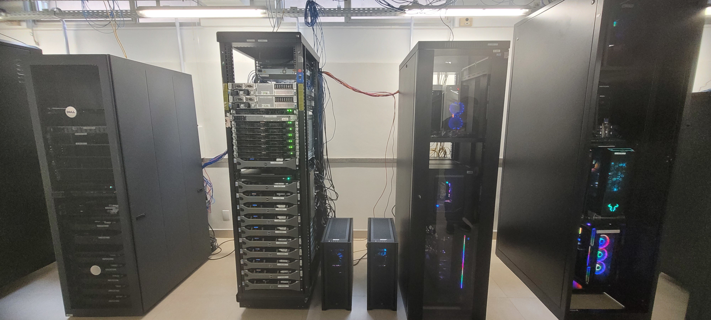
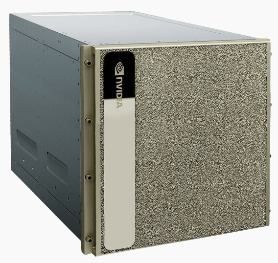
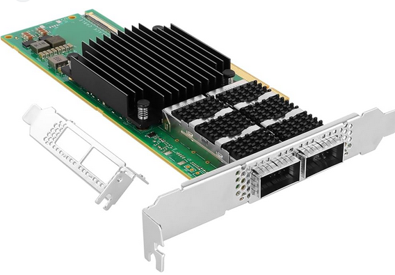
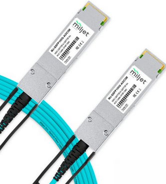

# -*- org-export-babel-evaluate: nil -*-
# -*- coding: utf-8 -*-
# -*- mode: org -*-
#+startup: beamer overview indent

#+TITLE: Parque Computacional de Alto Desempenho (PCAD)
#+SUBTITLE:  Grupo de Processamento Paralelo e Distribuído (GPPD-HPC)
#+AUTHOR: Lucas Mello Schnorr
#+EMAIL: schnorr@inf.ufrgs.br
#+DATE: Instituto de Informática, UFRGS

#+LaTeX_CLASS: beamer
#+LaTeX_CLASS_OPTIONS: [10pt, presentation, aspectratio=169]
#+BEAMER_THEME: metropolis [numbering=fraction, progressbar=frametitle, sectionpage=none]
#+OPTIONS:   H:2 num:t toc:nil \n:nil @:t ::t |:t ^:t -:t f:t *:t <:t title:nil
#+LANGUAGE: pt-br
#+TAGS: noexport(n) ignore(i)
#+EXPORT_EXCLUDE_TAGS: noexport
#+EXPORT_SELECT_TAGS: export

#+LATEX_HEADER: \usepackage[utf8]{inputenc}
#+LATEX_HEADER: \usepackage[T1]{fontenc}
#+LATEX_HEADER: \usepackage{palatino}
#+LATEX_HEADER: \usepackage{xspace}
#+LATEX_HEADER: \usepackage[font=tiny,labelfont=bf]{caption}
#+LATEX_HEADER: \captionsetup[figure]{labelformat=empty}%
#+LATEX_HEADER: \usepackage[absolute,overlay]{textpos}
#+LATEX_HEADER: \usepackage{listings}
#+LATEX_HEADER: \definecolor{mblue}{HTML}{005c8b} 
#+LATEX_HEADER: \definecolor{morange}{HTML}{f58431} 

#+begin_export latex
\institute{
\\\bigskip
\textbf{Reunião E.A.T.}\\
Prédio da Administração, Instituto de Física da UFRGS\\
Porto Alegre, 10 de abril de 2026, 14h00\\\bigskip

\includegraphics[scale=0.12]{./logo/inf-logo-1.0.pdf}\hspace{2cm}%
\includegraphics[scale=0.17]{./logo/ufrgs.pdf}%
}
#+end_export
# +LATEX_HEADER:\newcommand*{\DEBUG}{}%
#+LATEX_HEADER: \newcommand{\BC}{\textrm{BC}\xspace}
#+LATEX_HEADER: \newcommand{\BCH}{\textrm{1D$\times$1D}\xspace}
#+LATEX_HEADER: \newcommand{\BCHC}{\textrm{1D$\times$1D-C}\xspace}
#+LATEX_HEADER: \newcommand{\BCHCS}{\textrm{1D$\times$1D-C+S}\xspace}
#+LATEX_HEADER: \setlength{\TPHorizModule}{1mm}
#+LATEX_HEADER: \setlength{\TPVertModule}{1mm}
#+LATEX_HEADER: \usepackage{booktabs}

#+latex:\ifdefined\DEBUG
#+latex:\setbeamertemplate{background canvas}{
#+latex:\begin{tikzpicture}[remember picture,overlay]
#+latex:\node [draw, thick, shape=rectangle, minimum width=3cm, minimum height=4cm, anchor=center] at (14,-6.5) {};
#+latex:\filldraw (14,-6.5) node [below] {WebCam Debug} circle (1pt);
#+latex:\end{tikzpicture} 
#+latex:}
#+latex:\fi

#+latex: \setbeamerfont{title}{size=\large}
#+latex: \setbeamerfont{subtitle}{size=\small}

#+LATEX: \setbeamercolor{normal text}{% 
#+LATEX:   fg=mblue, 
#+LATEX:   bg=black!2 
#+LATEX: } 
 
#+LATEX: \setbeamercolor{alerted text}{%
#+LATEX:   fg=morange
#+LATEX: } 

#+latex: \setbeamercolor{background canvas}{bg=white}

#+LATEX: {
#+LATEX:  \maketitle
#+LATEX: }

# +LaTeX: \setbeamertemplate{footline}[text line]{%
# +LaTeX:   \parbox{\linewidth}{\vspace*{-8pt}\hspace{-1cm}\hfill ERAD/RS 2023 - DevOps para HPC: Como configurar um cluster para uso compartilhado \hfill\insertframenumber~/ \inserttotalframenumber}}
#+LaTeX:  \setbeamertemplate{navigation symbols}{}

#+LaTeX: \newcommand\boldblue[1]{\textcolor{erad20blue}{\textbf{#1}}}
#+LaTeX: \newcommand\itred[1]{\textcolor{red}{\textit{#1}}}
#+LaTeX: \definecolor{dpotrfcolor}{rgb}{0.8675,0,0}
#+LaTeX: \definecolor{dgemmcolor}{rgb}{0,0.5625,0}
#+LaTeX: \definecolor{dsyrkcolor}{rgb}{0.5625,0,0.5625}
#+LaTeX: \definecolor{dtrsmcolor}{rgb}{0,0,0.8675}
#+LATEX: \definecolor{thegray}{rgb}{0.95,0.95,0.95}

* Visão Geral, Histórico e Requisitos
** Histórico

Plataforma em constante evolução
- Depende fortemente dos projetos dos professores
  - Heterogeneidade computacional
- Autogerida, com esforço de pós-graduandos voluntários
  - Discentes passam pelo sistema

#+latex: \pause

Preocupação com reprodutibilidade
- Implantação de um sistema de gerenciamento
- Configuração padrão para todas as máquinas
- Colocar os usuários (/experts/) em primeiro plano

#+latex: \pause

#+begin_center
Primeira organização geral em torno de \approx2018/2019

Parque Computacional de Alto Desempenho (PCAD)

https://pcad.inf.ufrgs.br/
#+end_center

** Parque Computacional de Alto Desempenho (PCAD)

URL: http://pcad.inf.ufrgs.br/

Possui aproximadamente 50 nós, 1000+ núcleos de CPU e 100000+ de GPU

#+attr_latex: :width .85\linewidth

Localização: /Data Center/ do Instituto de Informática, UFRGS

** Algumas configurações selecionadas de HW para cálculo
*** Right                                                           :BMCOL:
:PROPERTIES:
:BEAMER_col: 0.45
:END:

#+latex: \smallskip

Processadores Intel Xeon
- E5530 Nehalem, X7550 Nehalem
- E5-2630 Sandy Bridge
- E5-2640 v2 Ivy Bridge
- E5-2650 v3 Haswell
- E5-2699 v4 Broadwell
- Gold (5317 Ice Lake, 6226 C. Lake)
- Silver (4208 C. Lake, 4116 Skylake)
# - Phi 7250 Knights Landing

Processadores Intel Core
- Intel Core i7-10700F, i7-14700KF
- Intel Core i9-14900KF

Processadores NVIDIA
- 2\times NVIDIA Grace CPU Superchip

*** Left                                                            :BMCOL:
:PROPERTIES:
:BEAMER_col: 0.45
:END:

Processadores AMD
- AMD Ryzen 9 3950X Zen2
- AMD RYZEN 5 3400G Zen+

Aceleradoras NVIDIA
- 6\times GTX1080Ti
- 4\times P100
- 1\times RTX3090
- 5\times RTX4070
- 6\times RTX4090

Outras aceleradoras

- 4\times NEC 10BE SX-Aurora
- 3\times AMD Radeon RX 7900 XT

** Requisitos almejados da infraestrutura
*** Para os usuários

- Serem independentes para realização de experimentos
- Fácil utilização (assumindo claro um conhecimento de Linux)
- Acesso isolado, irrestrito e com máximo desempenho aos recursos (/bare metal/)
- Algumas facilidades (Sistema de arquivos global, Fila de utilização dos recursos)

#+latex: \pause

*** Para os professores

- Controlar o grupo de usuários que usa um subconjunto de máquinas
- Não se preocupar com o gerenciamento da máquina do seu projeto

#+latex: \pause

*** Para os administradores

- Mutualização e melhor aproveitamento dos recursos computacionais
- Instalação relativamente fácil \to Pouca manutenção (idealmente: /install and forget/)
- Registro de todas as ações do usuário
  
** Filosofia geral da plataforma

- Garantia inspirada na GPLv3, sistema fornecido ``as-is''
  - Sem backups, sem garantia que vá funcionar, tudo pode ser
    desligado sem aviso prévio
  - Trabalho voluntário de discentes da pós-graduação (PPGC)

#+latex: \vfill\pause

- Abordagem centralizada (um único controlador, o /front-end/)
  #+begin_src shell :results output :exports both :eval no
  ssh pcad.inf.ufrgs.br
  #+end_src
- Um único sistema operacional, sem virtualização, sem /deploy/

#+latex: \pause

- Usuários responsáveis pela maioria das bibliotecas
  - Emprego de =podman=, =spack=, =guix=, =nix= em função da experiência do usuário
  - Não instalamos pacotes para os usuários

#+latex: \pause

- Requerimentos especiais para controle experimental
  - Controlar frequência de CPU e GPU
  - Desativar/ativar cores, turboboost, hyperthreading, ...
  - Configurações específicas em BIOS
  - Uso de discos locais (/scratch/) para experimentos com dados
    
* Configurações de HW e SW
** Sistema base e gerenciamento de usuários e arquivos
*** Sistema base \to Debian GNU/Linux                                                 

- /Free Software/, existe desde \approx1993
- Versão /stable/ com LTS, atualmente Debian 12

*** Gerenciamento de usuários \to LDAP (com OpenLDAP)

- /Free Software/, mantido pela Fundação OpenLDAP (desde \approx1998)
  - Unificação de todos os usuários e dados do perfil (UID, GID)
- Acesso utilizando chaves ssh (não existem senhas)

*** Sistema de Arquivos de rede \to NFS

- Sistema presente direto no kernel do Linux
  - Transparente, não requer configurações extras pelo usuário
- Compartilha o diretório =$HOME= entre todas as máquinas

** Sistema de compartilhamento de recursos \to =slurm=
*** Slurm
:PROPERTIES:
:BEAMER_col: 0.8
:BEAMER_opt: [t]
:BEAMER_env: block
:END:

- Escalonar alocações e tarefas dos usuários nas máquinas
- Amplamente utilizado em diversos supercomputadores
  - Eficiente (realização do escalonamento e qualidade do mesmo)
- Isolar os ambientes (nós ou recursos intra-nó)

#+latex: \pause\bigskip

Slurm é peça fundamental para gerenciar a heterogeneidade
- Emprega-se o conceito de partição
  - Nós que pertencem a uma partição são homogêneos (quase sempre)
- Temos \approx21 partições, muitas com somente 1 máquina

** Infraestrutura da interconexão física

#+begin_export latex
\centering
\only<1>{\includegraphics[width=0.9\linewidth]{"img/PCAD_1.pdf"}}%
\only<2>{\includegraphics[width=0.9\linewidth]{"img/PCAD_2.pdf"}}%
\only<3>{\includegraphics[width=0.9\linewidth]{"img/PCAD_3.pdf"}}%
\only<4>{\includegraphics[width=0.9\linewidth]{"img/PCAD_4.pdf"}}
#+end_export

** Atualização em futuro próximo 1/2 (560k USD)

Receberemos via FINEP Proinfra projeto Multi-Cad um nó *NVIDIA DGX B200*

*** Left                                                             :BMCOL:
:PROPERTIES:
:BEAMER_col: 0.58
:END:

| 8x NVIDIA Blackwell GPUs (B200)       |
| GPU RAM 1.440GB total                 |
| 2x Intel Xeon Plat. 8570, 112 cores   |
| RAM 2TB DDR5 4800 MT/s ECC Reg        |
|---------------------------------------|
| 4x OSFP, 2x QSFP112 (até 400Gb/s)     |
| 2\times 10GbE RJ45 (management)            |
|---------------------------------------|
| Disco OS: 2x 1,9TB NVMe M.2           |
| Disco Interno: 8x 3,84TB NVMe U.2     |
|---------------------------------------|
| NVIDIA AI Enterprise                  |
| Mission Control + Run:ai              |
| DGX OS (Ubuntu)                       |
|---------------------------------------|
| Rack units: 10Us - Weight: 142.4Kg    |
| 444mm (A) × 482,2mm (L) × 897,1mm (P) |

*** Right                                                            :BMCOL:
:PROPERTIES:
:BEAMER_col: 0.45
:END:

** NVIDIA DGX B200 Desempenho computacional
*** Left                                                             :BMCOL:
:PROPERTIES:
:BEAMER_col: 0.58
:END:

**** Principal recurso computacional

| 8x NVIDIA Blackwell GPUs (B200)   |
| GPU RAM 1.440GB total             |
| DGX OS: CUDA, CUDA-X, NGC Catalog |

**** Comparação das precisões FP

| Precisão    | Por GPU (B200) | 8x GPUs (DGX B200)  |
|-------------+----------------+---------------------|
| FP4         | 18 petaFLOPS   | 144 petaFLOPS       |
| FP8         | 9 petaFLOPS    | 72 petaFLOPS        |
| FP16 / BF16 | 4,5 petaFLOPS  | ~36 petaFLOPS       |
| TF32        | 2,2 petaFLOPS  | ~17,6 petaFLOPS     |
| FP32        | 75 teraFLOPS   | ~600 teraFLOPS      |
| FP64        | 37 teraFLOPS   | ~296 teraFLOPS      |

*** Right                                                           :BMCOL:
:PROPERTIES:
:BEAMER_col: 0.45
:END:

#+attr_latex: :width .8\linewidth

** Atualização em futuro próximo 2/2 (25k USD)

Praticamente todos os nós computacionais serão equipados com rede 100Gbit/s

*** Left                                                            :BMCOL:
:PROPERTIES:
:BEAMER_col: 0.48
:END:

**** Atualização para uma rede 100Gbit/s

|  # | Qtd | Descrição                     |
|----+-----+-------------------------------|
| 01 |   8 | Placa ConnectX-4 25Gb x8      |
| 02 |  11 | Placa ConnectX-4 100Gb x16    |
| 03 |  11 | Placa ConnectX-6 100Gb x16    |
| 04 |   1 | Placa ConnectX-6 100Gb x8     |
| 05 |   2 | Cabo 100Gb Breakout 4x25Gb 3m |
| 06 |   2 | Cabo 100Gb Breakout 4x25Gb 7m |
| 07 |  12 | Cabo 100Gb 3m                 |
| 08 |  15 | Cabo 100Gb 7m                 |
|----+-----+-------------------------------|

*** Right                                                           :BMCOL:
:PROPERTIES:
:BEAMER_col: 0.48
:END:

#+attr_latex: :width .7\linewidth

#+attr_latex: :width .3\linewidth

*** Center                                                :B_ignoreheading:
:PROPERTIES:
:BEAMER_env: ignoreheading
:END:

E estaremos conectados na rede e-Ciência da RNP via 100Gbit/s.

* Demonstração

* Pesquisa

* Tendências, Referências e Conclusão
** Referências

DevOps para HPC: Como configurar um cluster para uso compartilhado
- https://lnesi.gitlab.io/mc-hpc-share/
- https://cradrs.github.io/eradrs2023/pdfs/minicursos/cap-3.pdf

Boas práticas para experimentos HPC
- https://exp-hpc.gitlab.io/
- Série de minicursos desde 2019 na ERAD/RS, ERAD/SP, WSCAD

Grupo de Processamento Paralelo e Distribuído (GPPD/HPC)
- HPC, novas arquiteturas, paradigmas de prog. paralela, análise de desempenho
- https://www.inf.ufrgs.br/gppd/site/

** Contato
*** Contato                                                          :BMCOL:
:PROPERTIES:
:BEAMER_col: 0.5
:END:

#+begin_center
Obrigado pela atenção!
#+end_center

#+begin_center
schnorr@inf.ufrgs.br
#+end_center

#+begin_center
PCAD

http://pcad.inf.ufrgs.br/
#+end_center

#+attr_latex: :width .5\linewidth
[[./logo/inf-logo-1.0.pdf]]

*** QrCode                                                           :BMCOL:
:PROPERTIES:
:BEAMER_col: 0.5
:END:
#+attr_latex: :width .7\linewidth

